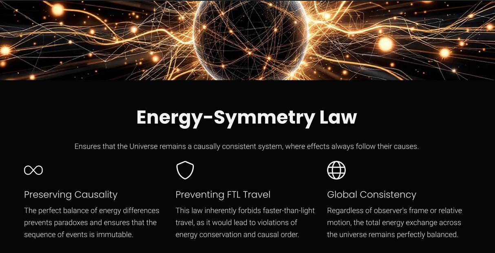
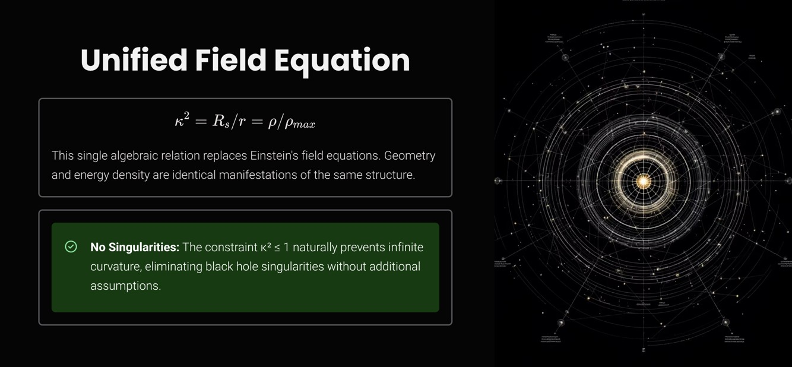
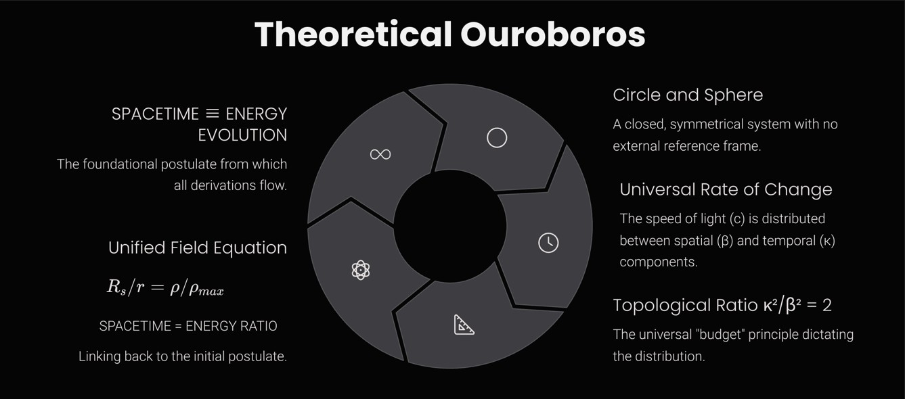
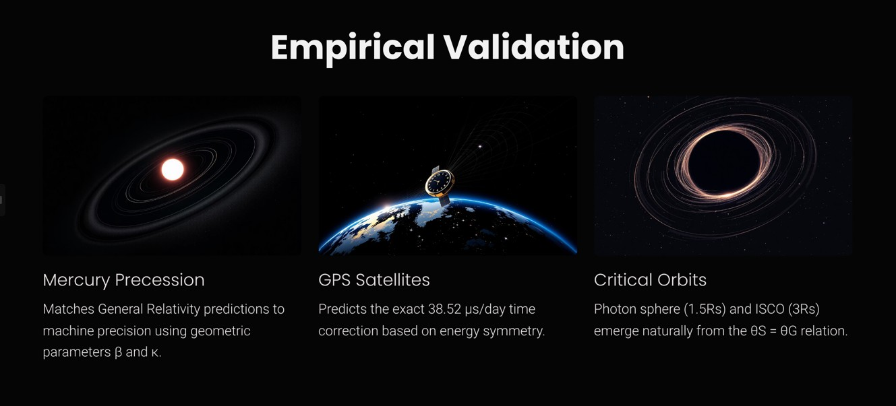
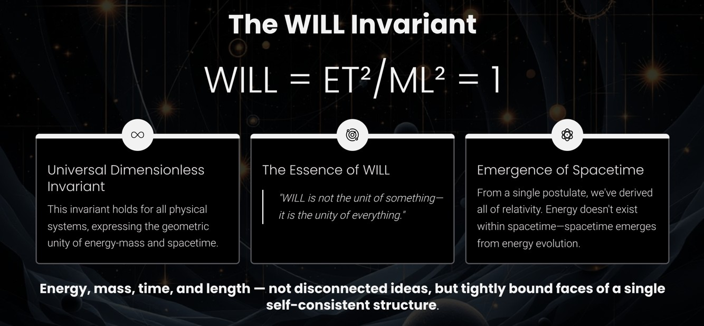

---  

layout: default  
title: "Relativistic Foundations" 

---  

 

# WILL Part I: Relational Geometry

---

## What is This Page?

This interactive page was created to **explain the essential meaning and logic of the WILL Geometry model** — but **without** the heavy mathematical machinery.

Here, the focus is on the core ideas, intuitive explanations, and geometric visualizations, making this new approach to fundamental physics accessible to a much wider audience (hover-tooltips added for clarity).

If you want to see the full mathematical derivations, download the complete documents here:  
[Full WILL Geometry Papers](https://antonrize.github.io/WILL/parts/)

---

  
  
▶ Quick Glossary: Key Terms & Concepts
  
  
  
    
<strong>Beta (β):</strong>  The kinetic <abbr title="mapping of one quantity onto another axis or dimension">projection</abbr>. Representing the ratio of an object's velocity to the universal speed of evolution (β = v/c). It quantifies how much of the "speed of change" is perceived as motion through space relative to observer. Not an intrinsic property of an object but rather a measure of the differences between states, perceived from the perspective of an observer.
  
    
<strong>Kappa (κ):</strong>  The potential <abbr title="mapping of one quantity onto another axis or dimension">projection</abbr>. It measures how deeply an object is situated within a gravitational field, relative to an observer, and asociated with <abbr title="The speed object has to move to escape the gravitational field">escape velocity</abbr>  (κ = v_e/c). It indicates proximity to an event horizon, at κ = 1 object has to move with the speed of light (c) in order to escape gravity (event horizon). Not an intrinsic property of an object but rather a measure of the differences between states, perceived from the perspective of an observer.
  
    
<strong>Universal Speed of Evolution (c):</strong> Another name for the speed of light, viewed here as the fundamental, <abbr title="a quantity that remains unchanged under transformations">invariant</abbr> tempo of change in the universe. It is not merely the speed of light but the constant rate at which all energetic interactions and transformations occur, speed limit for any change or information transfer.
  
    
<strong>Epistemological Hygiene:</strong> The principle of removing all unnecessary assumptions when building a theory, using only what’s logically required (nothing extraneous).
  
    
<strong>Event Horizon:</strong> The boundary around a black hole beyond which nothing can escape. (At this “point of no return,” the escape velocity equals the speed of light.)
  
    
<strong>Photon Sphere:</strong> A region near a black hole (about 1.5 times the Schwarzschild radius) where light can orbit in a circle if moving tangentially. It's an unstable orbit – light can fall in or escape if perturbed.
  
    
<strong>Critical Density:</strong> The maximum energy density that can can be packed into a given radius, dependent on central mass and the distance from it center. It increases closer to a central mass but never becomes infinite, thus preventing the formation of infinite densities (singularities).
  
    
<strong>Singularity:</strong> A point of infinite density where conventional physics breaks down. Standard GR predicts singularities (e.g. inside black holes); WILL Geometry avoids them by enforcing a finite critical density.
  
    
<strong>Energy–<abbr title="a property of a system that remains unchanged under transformations">symmetry</abbr> Law:</strong> The rule that energy differences always balance out between perspectives. If one observer sees a gain, another sees an equal loss — preventing any “free” energy or causality violations (this also ensures a universal speed limit).
  
  
  

---

    
    

        

            This page explores a foundational model of physics built from a single principle. Instead of describing observed phenomena with external laws, it <strong class="text-white">generates the laws of physics</strong> as an inevitable consequence of that principle.
        

    

---

    
    

        

            To construct a theory from a single idea without introducing new postulates requires an uncompromising methodology. These pillars serve as the logical rules that guide the entire framework, ensuring no hidden assumptions or arbitrary constants are smuggled in.
        

    

---

    
    

        

            This approach follows a powerful historical pattern. The greatest leaps in physics have consistently come not from adding new entities, but from <strong class="text-white">removing a false separation</strong>. Just as Copernicus removed the Earth/cosmos divide and Einstein unified space and time, this framework targets the final, unexamined split in modern physics.
        

    

---

    
    

        

            The contemporary split is between the <strong class="text-white">structure</strong> of the universe (a fixed stage, or manifold) and the <strong class="text-white">dynamics</strong> that unfold upon it (fields and energy). This separation is not an empirical discovery but an implicit assumption—an "unpaid ontological debt". By removing it, we are forced to identify geometry and energy as two aspects of a single entity.
        

    

---

    
    

        

            Energy is the relational measure of difference between possible states, conserved in any closed whole.
          It is not an intrinsic property of an object, but comparative structure between states (and observers), always manifesting as transformation.
        

    

---

    
    

        

            These three constraints—<strong class="text-white">Closure, Conservation, and Isotropy</strong>—are immediate, unavoidable consequences of a universe built from a single, self-contained principle. The next crucial question is: what mathematical forms can possibly satisfy all these rigid requirements at once?
        

    

---

    
    
    

        

            <h4 class="font-semibold text-white">Lemma: Closure</h4>
            
Under Principle 4.1 (\(\text{SPACETIME} \equiv \text{ENERGY}\)), WILL is self-contained: there is no external reservoir into or from which the relational resource can flow.

        

        

            <h4 class="font-semibold text-white">Lemma: Conservation</h4>
            
Within WILL, the total relational "transformation resource" (energy) is conserved.

        

        

            <h4 class="font-semibold text-white">Lemma: Isotropy from Background-Free Relationality</h4>
            
If no external background is allowed, then no direction can be a priori privileged. Thus the admissible relational geometry of WILL must be maximally symmetric.

        

        

            <h4 class="font-semibold text-white">Theorem: Minimal Relational Carriers of the Conserved Resource</h4>
            
The only closed, maximally symmetric manifolds that can serve as minimal carriers of the conserved relational resource are:

            <ol class="list-decimal list-inside ml-4 mt-2">
                <li><strong class="text-white">\(S^1\)</strong> for <em>directional</em> (one-degree-of-freedom) relational transformation;</li>
                <li><strong class="text-white">\(S^2\)</strong> for <em>omnidirectional</em> (central, all-directions-equivalent) relational transformation.</li>
            </ol>
        

         

            
S¹ and S² are not spacetime geometries, but relational manifolds.

        

    

---

    

---

  
  
▶ Show Interactive Graph: Motion/Time on the Unit Circle (Desmos)
  
  
  
    
  
      <iframe src="https://www.desmos.com/geometry/mpdksbsf9q" width="100%" height="500" frameborder="0"></iframe>  
    
  
  
  

---
    
    

        <h3 class="text-2xl font-bold text-white mb-4">The Duality of Transformation</h3>
        
        

            <h4 class="font-semibold text-white">Lemma: Duality of Evolution</h4>
            
The identification of spacetime with energy and its transformations necessitates two complementary relational measures:

            <ol class="list-decimal list-inside ml-4 mt-2">
                <li>the <strong>extent</strong> of transformation (external displacement), and</li>
                <li>the <strong>sequence</strong> of transformation (internal order).</li>
            </ol>
        

        

            <h4 class="font-semibold text-white">Proof</h4>
            
Any complete description of transformation must specify both what changes and how that change is internally ordered. A single measure cannot capture both. The circle \(S^1\) provides the minimal geometry enforcing such complementarity: its orthogonal projections furnish precisely two non-redundant coordinates.

        

        
We define these orthogonal projections as follows:

        <ul class="list-disc list-inside ml-4 mt-2 space-y-2">
            <li><strong>The Amplitude Component (\(\beta\)):</strong> This projection represents the <em>relational measure</em> between the system and the observer. It corresponds to the <em>extent</em> of transformation, which manifests physically as momentum.</li>
            <li><strong>The Phase Component (\(\beta_Y\)):</strong> This projection represents the <em>internal structure</em> of a system. It governs the intrinsic scale of its proper space and proper time units, corresponding to the <em>sequence</em> of its transformation. A value of \(\beta_Y=1\) represents a complete and undisturbed manifestation of this internal structure, a state we identify as rest.</li>
        </ul>

        <h3 class="text-2xl font-bold text-white mt-10 mb-4">Conservation Law of Relational Transformation</h3>

        

            <h4 class="font-semibold text-white">Theorem: Conservation Law of Relational Transformation</h4>
            
The orthogonal components of transformation (\(\beta,\beta_Y\)) are bound by the closure relation:

            
\(\beta^2 + \beta_Y^2 = 1\)

        

        

            <h4 class="font-semibold text-white">Proof</h4>
            
Since \(S^1\) is closed, every point on the circle is constrained by the Pythagorean identity of its projections. Thus no state can exceed or fall short of the finite relational "budget." This closure enforces conservation across all processes.

        

        <h3 class="text-2xl font-bold text-white mt-10 mb-4">Consequence: Relativistic Effects</h3>

        

            <h4 class="font-semibold text-white">Proposition: Physical Interpretation: Relativistic Effects</h4>
            
The conservation law implies that any redistribution between the orthogonal components (\(\beta,\beta_Y\)) manifests physically as the relativistic effects of time dilation and length contraction.

        

        

            <h4 class="font-semibold text-white">Proof</h4>
            
The components satisfy \(\beta^2 + \beta_Y^2 = 1\). An increase in the relational displacement \(\beta\) enforces a decrease in the internal measure \(\beta_Y\). This reduction of \(\beta_Y\) corresponds to dilation of proper time and contraction of proper length, while the growth of \(\beta\) represents momentum. Thus the relativistic trade-off is the direct physical expression of the geometric closure of \(S^1\).

        

        

            
The geometry of spacetime is the shadow cast by the geometry of relations.

        

    

---

    

---

  
  
▶ Show Interactive Graph: The Energy-Momentum Triangle (Desmos)
  
  
  
    
  
      <iframe src="https://www.desmos.com/geometry/ezmytl5lkh" width="100%" height="500" frameborder="0"></iframe>  
    
  
  
  

---

    

        <h2 class="text-3xl font-bold text-white text-center mb-6">Kinetic Energy Projection on \(S^1\)</h2>
        
Since \(S^{1}\) encodes one-dimensional displacement, the total energy \(E\) of the system must project consistently onto both axes:

        
\(E_{X} = E \beta_{X}, \qquad E_{Y} = E \beta_{Y}\)

        

            <h4 class="font-semibold text-white">Theorem: Invariant Projection of Rest Energy</h4>
            
For any state (\(\beta, \beta_Y\)) on the relational circle, the vertical projection of the total energy is invariant:

            
\(E \beta_Y = E_0\)

        

        

            <h4 class="font-semibold text-white">Proof</h4>
            
When \(\beta=0\), closure enforces \(\beta_Y=1\), yielding \(E=E_0\). Since closure applies for all \(\theta_1\), the vertical projection \(E\beta_Y\) remains equal to this rest value in every state.

        

        

            <h4 class="font-semibold text-white">Corollary: Total Energy Relation</h4>
            
From the theorem it follows that:

            
\(E = \frac{E_0}{\beta_Y} = \frac{E_0}{\sqrt{1-\beta^2}}\)

        

        
        

            
The historical Lorentz factor is the reciprocal of \(\beta_Y\): \(\gamma\) = 1/\(\beta_Y\).

        

        <h3 class="text-2xl font-bold text-white text-center mt-10 mb-6">Rest Energy and Mass Equivalence</h3>
        

            <h4 class="font-semibold text-white">Corollary: Rest Energy and Mass Equivalence</h4>
            
Within the normalization \(c=1\), the invariant rest energy equals mass:

            
\(E_{0} = m\)

        

        

            <h4 class="font-semibold text-white">Proof</h4>
            
From the invariant projection \(E\beta_Y = E_0\) and closure of \(S^1\), no additional scaling parameter is required. Hence the conventional bookkeeping identities \(E_0 = mc^2\) or \(m = E_0/c^2\) reduce to tautologies. Mass is therefore not independent, but the rest-energy invariant itself.

        

        

            
Mass is the invariant projection of total rest energy.

        

        
        <h3 class="text-2xl font-bold text-white text-center mt-10 mb-6">Energy–Momentum Relation</h3>
        

            <h4 class="font-semibold text-white">Proposition: Horizontal Projection as Momentum</h4>
            
On the relational circle, the unique relational measure of displacement from rest is the horizontal projection \(E\beta\); hence:

            
\(p \equiv E\beta \quad (c=1)\)

        

        

            <h4 class="font-semibold text-white">Corollary: Energy–Momentum Relation</h4>
            
With \(p\) identified by the proposition and \(m=E_0\), the closure identity yields:

            
\(E^{2} = p^{2} + m^{2} \quad (c=1)\)

            
Equivalently, upon restoring \(c\):

            
\(E^{2} = (pc)^{2} + (mc^{2})^{2}\)

        

        

            <h4 class="font-semibold text-white">Proof</h4>
            
By closure, \((E\beta)^2 + (E\beta_Y)^2 = E^2\). Substituting \(p=E\beta\) and \(m=E_0\) proves the claim. Restoring \(c\) is dimensional bookkeeping: \(p\mapsto pc\) and \(m\mapsto mc^{2}\), while \(E\) remains \(E\), yielding the standard form.

        

        

            
The relation \(E^{2}=p^{2}+m^{2}\) is the geometric identity of \(S^1\).

        

    

---

    
    

        
  
            
▶ Show Interactive Graph: Potential Energy projection on S² (Desmos)
  
            
  
                
  
                    <iframe src="https://www.desmos.com/geometry/ifeyu1yg2b" width="100%" height="500" frameborder="0"></iframe>  
                
  
            
  
        

        

            With both the kinetic (SR on \(S^1\)) and potential (GR on \(S^2\)) projections defined, we can now compose them. This composition reveals how WILL Geometry derives one of General Relativity's core postulates—the Equivalence Principle—not as an axiom, but as a structural necessity.
        

        

            
▶ Show Formal Derivation of Potential Energy Projection

            

                
Analogous to \(S^1\), the relational geometry of the sphere, \(S^2\), provides orthogonal projections for two aspects of omnidirectional transformation. We define them as follows:

                <ul class="list-disc list-inside ml-4 mt-2 space-y-2">
                    <li><strong>The Amplitude Component (\(\kappa\)):</strong> The <em>relational gravitational measure</em>. A value of \(\kappa=1\) corresponds to the event horizon.</li>
                    <li><strong>The Phase Component (\(\kappa_X\)):</strong> This projection governs the intrinsic scale of proper length and time units.</li>
                </ul>
                
These components are bound by the conservation law of the closed system:

                
\(\kappa_X^2 + \kappa^2 = 1\)

                <h4 class="text-xl font-bold text-white mt-6 mb-2">Consequence: Gravitational Effects</h4>
                
The redistribution of the budget between the Phase and Amplitude components produces the effects of General Relativity. An increase in the relational measure (\(\kappa\)) requires a decrease in the measure of the internal structure (\(\kappa_X\)). This geometric trade-off is observed physically as gravitational time corrections.

                <h4 class="text-xl font-bold text-white mt-6 mb-2">Gravitational Tangent Formulation</h4>
                
Just as the relativistic energy-momentum relation is expressed via \(\beta = \cos\theta_{1}\), its gravitational analogue follows from \(\kappa = \sin\theta_{2}\). We define the gravitational energy and momentum:

                
\(E_{g} = \frac{E_{0}}{\kappa_{X}}\) where \(\kappa_{X} = \sqrt{1 - \kappa^{2}}\)

                
\(p_g = E_{0}/c \cdot \tan\theta_{2}\)

                
This yields the gravitational energy relation: \(E_{g}^{2} = p_g^{2} + E_{0}^{2}\).

                

                    
\(\beta = \cos\theta_{1}, \qquad \kappa = \sin\theta_{2}\)

                    
\(\cot\theta_{1} \longleftrightarrow \tan\theta_{2}\)

                    
Kinematic momentum \(p\) and gravitational momentum \(p_g\) are dual projections, expressed through complementary trigonometric forms.

                

            
 

        

            <h3 class="text-2xl font-bold text-white text-center mb-6">Clear Relational Symmetry Between Projections</h3>
            
            

            

                <table class="w-full text-left border-collapse mt-4 text-base">
                    <thead>
                        <tr class="bg-gray-800">
                            <th colspan="2" class="p-3 text-center border border-gray-600">
                                
\(\beta=\beta_X, \quad \kappa=\kappa_Y, \quad \theta_1= \arccos(\beta), \quad \theta_2 = \arcsin(\kappa)\)

                                
\(\kappa^2 = 2\beta^2\)

                            </th>
                        </tr>
                        <tr class="bg-gray-700">
                            <th class="p-2 border border-gray-600">Algebraic Form</th>
                            <th class="p-2 border border-gray-600">Trigonometric Form</th>
                        </tr>
                    </thead>
                    <tbody>
                        <tr class="bg-gray-800/50">
                            <td class="p-2 border border-gray-600 font-mono">\(1/\beta_Y= \frac{1}{\sqrt{1-\beta^2}}\)</td>
                            <td class="p-2 border border-gray-600 font-mono">\(1/\sin(\theta_1) = 1/\sin(\arccos(\beta))\)</td>
                        </tr>
                         <tr class="bg-gray-800/50">
                            <td class="p-2 border border-gray-600 font-mono">\(1/\kappa_X = \frac{1}{\sqrt{1-\kappa^2}}\)</td>
                            <td class="p-2 border border-gray-600 font-mono">\(1/\cos(\theta_2) = 1/\cos(\arcsin(\kappa))\)</td>
                        </tr>
                        <tr class="bg-gray-800/50">
                            <td class="p-2 border border-gray-600 font-mono">\(\beta_Y = \sqrt{1-\beta^2}\)</td>
                            <td class="p-2 border border-gray-600 font-mono">\(\sin(\theta_1) = \sin(\arccos(\beta))\)</td>
                        </tr>
                        <tr class="bg-gray-800/50">
                            <td class="p-2 border border-gray-600 font-mono">\(\kappa_X = \sqrt{1-\kappa^2}\)</td>
                            <td class="p-2 border border-gray-600 font-mono">\(\cos(\theta_2) = \cos(\arcsin(\kappa))\)</td>
                        </tr>
                        <tr class="bg-gray-800/50">
                            <td class="p-2 border border-gray-600 font-mono">\(p=E_0\beta/\beta_Y\)</td>
                            <td class="p-2 border border-gray-600 font-mono">\(p=E_0\cot(\theta_1)\)</td>
                        </tr>
                        <tr class="bg-gray-800/50">
                            <td class="p-2 border border-gray-600 font-mono">\(p_g=E_0\kappa/\kappa_X\)</td>
                            <td class="p-2 border border-gray-600 font-mono">\(p_g=E_0 \tan(\theta_2)\)</td>
                        </tr>
                    </tbody>
                </table>
            

            <h4 class="text-xl font-bold text-white mt-8 mb-4">The Combined Energy Parameter \(Q\)</h4>
            
The total energy projection parameter unifies both aspects, describing the combined effects of relativity and gravity.

            

                
\(Q = \sqrt{\kappa^2 + \beta^2}\)

                
\(Q^{2} = 3\beta^2 = \frac{3}{2}\kappa^2 = \frac{3R_s}{2r}\)

                
\(Q_t = \sqrt{1-Q^2} = \sqrt{1-3\beta^2} = \sqrt{1-\frac{3}{2}\kappa^2}\)

                
\(Q_r = \frac{1}{Q_t}\)

            

            

                
Relativistic (\(\beta\)) and gravitational (\(\kappa\)) modes are dual aspects of one energy-transformation constraint.

            

        

    

---

  

    
    
    

        <h2 class="text-3xl font-bold text-white text-center mb-6">Equivalence Principle as a Derived Identity</h2>
        

            In General Relativity, the Einstein Equivalence Principle is introduced as an independent postulate: \(m_g \equiv m_i\). Within WILL Geometry, no such axiom is required.
        

        

            Composing the independent stretches from the kinematic (\(1/\beta_Y\)) and gravitational (\(1/\kappa_X\)) projections gives the total local energy:
        

        

             
\(E_{\text{loc}} = \frac{E_0}{\beta_Y \cdot \kappa_X} = \frac{E_0}{\sqrt{(1-\beta^2)(1-\kappa^2)}}\)

        

        

            The inertial (\(\tilde p\)) and gravitational (\(\tilde p_g\)) projections share the same operational scale, governed by an identical effective mass factor, \(m_{\text{eff}}\). Hence, the equality is not assumed but is forced by the structure:
        

        

            
\(m_g \equiv m_i = m_{\text{eff}}\)

        

        

            <h4 class="font-semibold text-white">Remark on Eötvös-type precision</h4>
            
In WILL, the only invariant is \(E_0\), and the effective response is the universal stretch factor \(1/(\beta_Y\kappa_X)\). Since this factor depends solely on geometry and not on the composition of the test body, the universality of free fall follows by construction. What GR postulates, WILL reproduces as structural necessity.

        

        
        

            
<strong>What GR posits as a postulate, WILL delivers as an unavoidable consequence.</strong>

        

        

            This derived equivalence is a profound consequence of composing the two projections. The framework's consistency, however, demands an even deeper connection: a precise 'exchange rate' that must exist between the kinetic and potential modes themselves.
        

    

--- 

    
    
    

        <h2 class="text-3xl font-bold text-white text-center mb-6">Unification of Projections: The Geometric Exchange Rate</h2>
        

            The Principle of a unified relational resource (Energy) requires a self-consistent "exchange rate" between its kinetic and potential modes. This rate is not an arbitrary parameter but is dictated by the intrinsic geometry of the relations themselves.
        

        <h4 class="text-xl font-bold text-white mt-6 mb-2">1. The Ratio of Relational Degrees of Freedom</h4>
        

            An omnidirectional spherical relation (\(\kappa^2\) on \(S^2\)) requires two degrees of freedom (2D), while a directional circular relation (\(\beta^2\) on \(S^1\)) requires only one (1D). The intrinsic ratio is therefore 2. This is formally expressed as the ratio of their total solid angles:
        

        
\(\frac{\text{Total Closure of } S^2}{\text{Total Closure of } S^1} = \frac{4\pi}{2\pi} = 2\)

        <h4 class="text-xl font-bold text-white mt-6 mb-2">2. The Quadratic Nature of Energetic Realization</h4>
        

            Energy is fundamentally quadratic in nature. The energetic significance of a state is proportional not to the amplitude of a projection (\(\beta\), \(\kappa\)), but to its <strong>square</strong> (\(\beta^2\), \(\kappa^2\)).
        

        

            <h4 class="font-semibold text-white">Proposition: Energetic Closure Criterion</h4>
            
In closed regimes, the unique quadratic balance compatible with directional (\(S^1\)) vs omnidirectional (\(S^2\)) resource splitting is:

            
\(\kappa^2=2\beta^2\)

        

        

            <h4 class="font-semibold text-white">The Principle as a Diagnostic Invariant</h4>
            
The relation \(\kappa^2 = 2\beta^2\) holds if the system is energetically closed (e.g., circular orbits). In open systems, its violation can be used to determine the magnitude of energy flow through unaccounted-for channels. When all channels are included, the equality is restored.

        

        
        

            
▶ Show Illustrative Examples

            

                <ul class="list-disc list-inside space-y-4">
                    <li>
                        <strong>Circular Orbit (Closed Subsystem):</strong> For a test body in a perfectly circular orbit, the condition \(\kappa^2 = 2\beta^2\) is exactly fulfilled. The system is energetically closed, and the equality signals full closure.
                    </li>
                    <li>
                        <strong>Radiating Binary (Open Subsystem):</strong> For a binary system emitting gravitational waves, considering only orbital mechanics will show a violation of \(\kappa^2 = 2\beta^2\). This reveals the magnitude of energy flow through the unaccounted-for gravitational wave channel. When this channel is included in the balance, the equality holds again.
                    </li>
                </ul>
            

        

        

            
<strong>Geometric Distribution (\(\kappa^2\)) ≡ Kinetic Distribution (\(\beta^2\)) × 2</strong>

        

        

            This topological ratio is the fundamental 'exchange rate' for energy within any closed system. It allows us to unify both kinetic and potential projections into a single, combined vector that describes the total energetic state of an object.
        

    

---

    
    

        <h2 class="text-3xl font-bold text-white text-center mb-6">The Total Projection Parameter Q</h2>
---

  
  
▶ Show Interactive Graph: Q Circle (Desmos)
  
  
  
    
  
      <iframe src="https://www.desmos.com/geometry/vo5xxlcglf" width="100%" height="500" frameborder="0"></iframe>  
    
  
  
  

---

        

            The combined effects of the kinetic (\(\beta\)) and potential (\(\kappa\)) projections are unified into a single vector, \(Q\), representing the system's total projection budget.
        

        

            
\(Q = \sqrt{\kappa^2 + \beta^2}\)

            
\(Q^{2} = 3\beta^2 = \frac{3}{2}\kappa^2\)

            
\(Q_t = \sqrt{1-Q^2}\)

        

        

            This parameter describes the total energetic state of a closed system. Its boundary condition, \(Q=1\), corresponds to a critical state of the system—the photon sphere, where the geometry reaches its null-circumnavigation limit.
        

         

            While the \(Q\) parameter describes the static geometric state of a system, transformations <em>between</em> states are governed by the framework's core dynamical rule: the Energy-Symmetry Law.
        

    

---

## Energy as a Relation — What κ and β Actually Mean

### Key Principle:

**Energy isn't something objects "have" — it's a measure of differences between states.**

When we drop anthropocentric distortions, a clear and intuitive picture emerges:
- Physical parameters like energy, speed, and gravitational potential don't belong to objects.
- Instead, they represent how we, as observers, measure differences from our own point of view.
    

In this relational view, your perspective is always the reference frame. You are always at zero. Everything else is described by how it differs from your state:
- **β (Beta)** is not an intrinsic property of a moving object. It is a measure of how much of the universal "speed of change" you see as motion through space, relative to yourself.
- **κ (Kappa)** doesn't describe an object's "stored" gravitational energy. It measures how deeply an object sits in a gravitational field, as seen from your position. It's your personal "ruler" for gravitational depth.
    

Think of κ and β as your own relational measuring tools:
- **β** is how far along your "motion ruler" you project another object's state.   
- **κ** is how deep into your "gravity well" you see another object's state.
    
Energy thus emerges naturally:
- Energy is simply the capacity to move between states — it's not possessed, but relationally defined. 
- Saying "the object's energy" always implicitly means "the object's energy as measured from your perspective."
    
Here's a simple analogy:
> Imagine standing on a train platform. A train passes by rapidly: to you, it has significant kinetic energy. But if you jump onto the train, it instantly becomes stationary relative to you. Its kinetic energy is now zero — because your frame of reference shifted. The energy didn't vanish; your perspective changed.

**Bottom line:**

- Energy, κ, and β aren't hidden intrinsic qualities; they're your personal, relational measurements.
    
- All physics boils down to describing how things differ from your chosen point of view. No more, no less.

---

    
    
    

        <h2 class="text-3xl font-bold text-white text-center mb-6">The Energy-Symmetry Law</h2>

        

            <h4 class="font-semibold text-white">Theorem: Energy Symmetry</h4>
            
The specific energy differences (per unit of rest energy) perceived by two observers for a transition between their states balance according to the Energy-Symmetry Law:

            
\(\Delta E_{A \to B} + \Delta E_{B \to A} = 0\)

        

        

            <h4 class="font-semibold text-white">Proof</h4>
            
Consider observer A at rest (\(\beta_A=0\)) on a surface with potential \(\kappa_A\), and observer B in an orbit with potential \(\kappa_B\) and velocity \(\beta_B\). The total specific energy for the transition \(A \to B\) is the sum of the change in potential and kinetic energy budgets:

            
\(\Delta E_{A \to B} = \frac{1}{2}\left((\kappa_A^2 - \kappa_B^2) + \beta_B^2\right)\)

            
From B's perspective, the transition \(B \to A\) yields:

            
\(\Delta E_{B \to A} = \frac{1}{2}\left((\kappa_B^2 - \kappa_A^2) - \beta_B^2\right)\)

            
Summing these transfers gives \(\Delta E_{A \to B} + \Delta E_{B \to A} = 0\). No net energy is created or destroyed in a closed cycle of transitions.

        

        <h3 class="text-2xl font-bold text-white text-center mt-10 mb-6">Universal Speed Limit as a Consequence</h3>
        

            <h4 class="font-semibold text-white">Theorem: Universal Speed Limit</h4>
            
The universal speed limit (\(v \leq c\)) emerges from the requirement of energetic symmetry.

        

        

            <h4 class="font-semibold text-white">Proof</h4>
            
Assume an object could exceed the speed of light, implying \(\beta > 1\). The energy transfer required, \(\Delta E_{A \to B}\), would become arbitrarily large. Consequently, no finite physical process could provide a balancing reverse transfer, \(\Delta E_{B \to A}\), that would sum to zero. The fundamental symmetry would be broken. Therefore, the condition \(\beta \leq 1\) is an intrinsic requirement for maintaining the causal and energetic consistency of the relational universe.

        

        <h3 class="text-2xl font-bold text-white text-center mt-10 mb-6">Single-Axis Energy Transfer and the Nature of Light</h3>
         

            <h4 class="font-semibold text-white">Theorem: Single-Axis Transformation Principle</h4>
            
For light, the kinematic projection reaches its full extent: \(\beta = 1 \Rightarrow \beta_Y = 0\). All transformation of the relational energy occurs along a single orthogonal axis.

        

        

            <h4 class="font-semibold text-white">Proof</h4>
            
For massive systems, the energy exchange is distributed between two orthogonal projections. For light, \(\beta_Y = 0\), so the complementary projection disappears. The full relational resource is realized on a single projection. Therefore, the specific energy potential for light is not halved but complete, \(\Phi_\gamma = \kappa^2 c^2\), while for a massive body it remains partitioned, \(\Phi_{\text{mass}} = \frac{1}{2}\kappa^2 c^2\). This explains why light experiences a geometric effect exactly twice that of a massive particle in the same field.

        

        

            
▶ Show Simplification for Closed Orbits

            

                
When the closure condition for stable orbits (\(\kappa^2 = 2\beta^2\)) is applied, the general law simplifies.

                <ul class="list-disc list-inside space-y-4 mt-4">
                    <li>
                        <strong>Surface-to-Orbit Transfer:</strong> The specific energy balance is given by: 
                        \(\frac{E_{A \to B}}{E_{0B}} = \frac{1}{2}(\kappa_A^2 - \beta_B^2)\)
                    </li>
                    <li>
                        <strong>Orbit-to-Orbit Transfer:</strong> The balance reduces further, with the potential terms cancelling out completely: 
                        \(\frac{E_{A \to B}}{E_{0B}} = \frac{1}{2}(\beta_A^2 - \beta_B^2)\)
                    </li>
                </ul>
            

        

        
        

            
<strong>Causality is a built-in feature of Relational Geometry.</strong>

        

    

---

---

**At this moment, something amazing appears: it matches the “photon sphere” — the special zone around a massive object where light itself can orbit in a perfect circle.** (For a black hole, that’s at a distance of 1.5 times its radius.)

 
<strong>What happens to light at the photon sphere?</strong>
 At the photon sphere, a photon moving exactly along the perfect circle could orbit forever — but this path is incredibly unstable. If the photon’s path points even a tiny bit outward, it escapes to infinity. If it’s angled a bit inward, it falls into the black hole. So, the photon sphere is not a prison — it’s a tightrope. Light can still escape if it’s not traveling exactly along the circle. 

---

## Section 7: Energy–<abbr title="a property of a system that remains unchanged under transformations">symmetry</abbr> Law

---

---

### The Big Idea

Whenever you compare two observers (say, someone on the ground and someone in orbit), **the energy differences they see will always perfectly balance out.** No matter how you swap perspectives — nobody ever gets “extra” energy for free. This is the universe’s built-in law of energetic fairness.

---

### How it Works (Without Math)

Imagine:

- Observer **A** is standing on the ground.
    
- Observer **B** is orbiting above.
    

If an object moves from A (the ground) up to B (orbit):

- It has to *fight gravity* (gaining potential energy).
    
- It needs to *speed up* (gaining kinetic energy).
    

From B’s point of view, if the object comes *down*:

- It *drops* into stronger gravity (loses potential energy).
    
- It *slows down* to rest (loses kinetic energy).
    

**But if you add up both “energy stories,” the total change is always zero.**

> The universe never “creates” or “loses” energy when you swap perspectives — it just moves it around.

 
<strong>Show the math</strong>
  

 
$$
\Delta E_{A \to B}=\frac{1}{2}((\kappa_{A}^{2}-\kappa_{B}^{2})+\beta_{B}^{2})
$$
 
$$
\Delta E_{B \to A}=\frac{1}{2}((\kappa_{B}^{2}-\kappa_{A}^{2})-\beta_{B}^{2})
$$
 
$$
\Delta E_{A \to B} + \Delta E_{B \to A} = 0
$$

Each transfer includes both gravitational ($κ^2$) and kinetic ($β^2$) parts, always balancing out.

---

### Universal Speed Limit: Why Nothing Goes Faster than Light

This “energy <abbr title="a property of a system that remains unchanged under transformations">symmetry</abbr>” is so strict that it naturally sets the universe’s ultimate speed limit.

- If something *could* go faster than light, the balance would be broken — one observer would see “extra” energy appear out of nowhere.
    
- That’s not allowed: **causality and energy <abbr title="a property of a system that remains unchanged under transformations">symmetry</abbr> would both collapse.**
    
- So, the speed of light isn’t just a cosmic “speed trap” — it’s the built-in edge of energetic fairness.
    

 
<strong>Math explanation</strong>

Assume an object could exceed the speed of light ($ \beta > 1$). In that scenario:

- The kinetic component ($\beta$) surpasses unity excessively, causing an irreversible imbalance in energy transfer.

- No reciprocal transfer could balance this energy, breaking the fundamental <abbr title="a property of a system that remains unchanged under transformations">symmetry</abbr>:

$$\Delta E_{A \rightarrow B} + \Delta E_{B \rightarrow A} \neq 0$$

Thus, $ \beta \leq 1$ ($v \leq c$) is required intrinsically to preserve causal and energetic consistency.

**In plain English:**

- The universe is like the world’s most perfect accountant: every bit of energy spent or gained in one place is balanced by what’s lost or gained elsewhere.
    
- The speed of light is where this balance can just barely be maintained — go past it, and the rules snap.
    

---

## Section 8: The Whole Universe in a Single Line

After all the geometric juggling, here’s the punchline: **Everything — gravity, motion, energy, even the rules for black holes — can be summed up in just one line.**

---

---

$$
\kappa^2 = \frac{R_s}{r_d} = \frac{\rho}{\rho_{max}}
$$  

 
<strong>See the Universe's one-line "code"</strong>

$$
\kappa^2 = \frac{R_s}{r_d} = \frac{\rho}{\rho_{max}}
$$

$r_{d} = \frac{R_s}{\kappa^2} = \frac{2Gm_0}{\kappa^2 c^2}$ (radial distance from the central mass)
   
$R_s=\frac{2Gm_0}{c^2}$ (Schwarzschild radius. Radius from the center of mass where event horizon is forming)
   
$\rho = \frac{\kappa^2 c^2}{8\pi G r_{d}^2} = \kappa^2 \cdot \rho_{max}$ (Energy/mass density in the given radius)
   
$\rho_{max} = \frac{c^2}{8\pi G r_{d}^2}$ (Maximal energy density where $\kappa=1$ event horizon)

---

### What does this actually mean?

In plain words:
**(Gravitational depth) = (fraction of critical radius reached) = (fraction of maximum density
reached)**

Let’s unpack the terms:

- $R_s$ is the critical radius for a given mass – essentially the Schwarzschild radius (the radius of a black hole event horizon for that mass).
- $r_d$ is the distance from the center we are considering (the current radius).
- $\rho$ is the energy density (including mass as energy) at that radius.
- $\rho_{\max}$ is the critical density at that radius, meaning the maximum energy density that location can sustain without collapsing into a black hole.

The equation $\frac{R_s}{r_d} = \frac{\rho}{\rho_{\max}}$ says that at any radius in the universe, the
proportion of “used-up” gravitational potential (left side) equals the proportion of the allowed energy
density that is filled (right side). It’s a statement of cosmic balance: no matter how you express the
contents of the universe – as curvature of space (via fraction of critical radius reached) or as concentration
of energy (via fraction of maximum density reached) – you end up with the same fraction of the extreme limit.
Another way to phrase it: you are always at a fixed fraction of a total “energy-capacity” of space, locally. This fraction is $\kappa^2$, which
doubles as the fraction of the way to becoming a black hole (since $R_s$ is the black hole threshold) and
the fraction of maximum density achieved.

This deceptively simple relation has profound consequences. In standard general relativity, if too much
mass-energy is compressed in too small a volume, the theory predicts a singularity – a point of infinite
density and zero volume – hidden behind an event horizon. Such singularities are places where physics
as we know it ceases to work. But in WILL Geometry, the unified equation forbids reaching an infinite
density. There is always a local maximum $\rho_{\max}$ given by the equation, which increases as you
go inward but never becomes infinite at a finite radius (for details see section "Zeno-Type Divergence in Black Hole Infall" in part II document).

> No matter how you look at it — as a distance, or as an amount of energy — the universe always keeps you within the same “safe fraction” of the maximum possible.

---

### The “Critical Density” Explained

- At every point in space, there’s a built-in “speed limit” for how much energy you can pack into that spot.
    
- The **critical density** ($ \rho_{max}$) isn’t universal — it depends on where you are (your distance from the center). The closer you get to the center, the higher this limit becomes — but it’s *never* infinite.
    

 
<strong>How is the density limit set?</strong>
  
$$
\rho_{max} = \frac{c^2}{8\pi G r_d^2}
$$

— “The smaller the radius, the greater the allowed density — but there’s always a cap.”

---

### What this solves

- In ordinary general relativity, a black hole means a “point of infinite density” (a singularity). That’s where the math — and the physics — break down.
    
- In WILL Geometry, such infinite densities are **impossible**. The universe always sets a maximum — so you never reach a breakdown or “divide by zero”.
    

> Instead of singularities, black holes become places where everything is packed to the maximum allowed, but always stays finite and well-behaved.

---

### Table: “Old School” GR vs. WILL Geometry

|  | **General Relativity (GR)** | **WILL Geometry** |
| --- | --- | --- |
| Geometry & Energy | Equated by differential equations | Identified algebraically (one-to-one) |
| Math Formalism | Complicated tensors, calculus | Simple, <abbr title="mapping of one quantity onto another axis or dimension">projection</abbr>-based logic |
| Singularities | Yes, possible (bad news!) | Impossible |
| Density Limit | Undefined (needs quantum gravity, still a mystery) | Always set, changes with position, never infinite |

**Bottom line:** This single “line of code” is the ultimate summary of WILL Geometry:

- **Geometry, energy, and density are always in sync.**
    
- **There’s always a local limit — and the universe never lets you break it.**
    
- **No infinities, no singularities, just pure, built-in self-consistency.**

  ---

### Closure of the Theoretical Framework

The unified field equation completes the ab initio derivation begun with the fundamental postulate:

$$
\text{SPACETIME} \equiv \text{ENERGY EVOLUTION}
$$

This is the unified geometric field equation we derived. It expresses the complete equivalence:

$$
\text{GEOMETRY} \equiv \text{ENERGY DISTRIBUTION}
$$

---

---

We have shown that this single postulate, through pure geometric reasoning, necessarily leads to an equation which mathematically expresses the very same equivalence we began with. We started with a single fundamental statement about energy and its evolution, from which geometry and physical laws are logically derived, and these derived laws then loop back to intrinsically define and limit the very nature of energy and space, proving the self-consistency of the initial postulate. From a philosophical and epistemological point of view, this can be considered the crown achievement of any theoretical framework — the "Theoretical Ouroboros". But let's remain skeptical. We are here for Physics!

> **Theoretical Ouroboros**  
> The WILL framework exhibits perfect logical closure: the fundamental postulate about the nature of spacetime and energy is proven as the inevitable consequence of geometric consistency.

---

## Section 9: Grounding the Vision – From Abstraction to Reality

A theory, no matter how beautiful, is just a clever idea until it passes real-world tests. Science is all about matching what we think to what we actually see in nature. A beautiful theory is useless if it does not align with what we observe. This section is devoted to grounding the abstract vision of WILL Geometry by demonstrating that it makes precise, testable predictions about real physical phenomena.

---

---

Let’s examine these two key examples, which serve as rigorous empirical tests of the entire theoretical construction.

### 1. Time Correction in the GPS System

The Global Positioning System (GPS) is perhaps the ideal laboratory for testing relativistic effects in everyday life. For the system to function with high accuracy, GPS satellites must account for two relativistic effects that influence the rate of their onboard clocks compared to clocks on Earth:

- **Special Relativity (SR) effect:** Satellites move at high speed (about 3.87 km/s), which causes their clocks to run slower than those on Earth. This effect is described by our kinetic <abbr title="mapping of one quantity onto another axis or dimension">projection</abbr> β.
    
- **General Relativity (GR) effect:** Satellites are at high altitude (about 20,200 km), where Earth's gravitational field is weaker. This causes their clocks to run faster than those on Earth. This effect is described by our potential <abbr title="mapping of one quantity onto another axis or dimension">projection</abbr> κ.
    

The standard approach is to calculate these two corrections separately and sum them. WILL Geometry offers a more fundamental approach. It asserts that these two effects are not independent, but are linked by the unbreakable relation κ² = 2β² and can be combined into a single unified energetic parameter Q, where Q² = κ² + β². Using this single parameter to calculate the overall relativistic time shift for the Earth–satellite system, WILL Geometry predicts that the clocks on GPS satellites should run ahead of ground-based clocks by about **38 microseconds per day**.

This result exactly matches the empirically measured value that must be continually added to the GPS system for it to function correctly. The success of this prediction is a powerful confirmation not only of the individual parts of the theory, but — more importantly — of the very principle of unification. It shows that treating kinetic and gravitational effects as unified geometric <abbr title="mapping of one quantity onto another axis or dimension">projection</abbr>s is not just a theoretical sophistication but a practical necessity for arriving at the correct answer.

---

  
  
▶ Show Interactive Graph: Earth GPS (Desmos)
  
  
  
    
  
      <iframe src="https://www.desmos.com/geometry/gfe2jpfh1g" width="100%" height="500" frameborder="0"></iframe>  
    
  
  
  

---

### 2. Precession of Mercury’s Orbit

One of the earliest triumphs of Einstein’s general relativity was its explanation of the anomalous precession (slow rotation) of Mercury’s elliptical orbit. Observations showed that the perihelion (the point closest to the Sun) of Mercury’s orbit shifts by an additional 43 arcseconds per century, above what Newtonian gravity predicted.

WILL Geometry also faces this classic test. Using its fundamental equations and parameters (β and κ, calculated for Mercury in the gravitational field of the Sun), the theory allows us to compute the expected value of this relativistic precession. The result obtained within WILL Geometry matches both the GR prediction and the observed data with machine-level precision.

Detailed calculations for both examples are provided in this document, but the narrative conclusion is clear: WILL Geometry is not merely a philosophical construction. It passes the most rigorous experimental and observational tests. It not only reproduces the successes of standard relativistic physics but does so from deeper, more unified first principles, lending its predictions extra weight and elegance. A theory born of pure logic finds its exact reflection in the workings of the real world. WILL Geometry stands up to every challenge that nature throws at it, not just matching standard physics, but explaining it from the ground up, using nothing but logic and geometry.

---

  
  
▶ Show Interactive Graph: Sun–Mercury (Desmos)
  
  
  
    
  
      <iframe src="https://www.desmos.com/geometry/hkxjqfkchp" width="100%" height="500" frameborder="0"></iframe>  
    
  
  
  

---

## Section 10: A New Reality of Change — Dynamics Without Time

Let’s get to the wildest part of WILL Geometry: **What if time isn’t fundamental at all?**

### Rethinking Change and Time

In “classic” physics, you always start with:

- A system’s current state.
    
- Rules (equations) that tell you how it changes step by step as time flows by.
    

Here, time is like a river: everything *happens inside* this flow.

**But in WILL Geometry, it’s the other way around:**

- There’s no separate “river” of time.
    
- There are just possible states — all the ways the universe could be, as long as they satisfy the balance equations.
    

### So what is “dynamics” now?

Instead of motion playing out *in* time, you have a web of “allowed” states, all rigidly connected. Any change in one parameter instantly forces all others to adjust, so the system stays in balance.

Imagine a black hole gaining mass:

- Its mass increases — but instantly, every other quantity (radius, curvature, energy density) also shifts, so the equations remain true.
    
- No waiting, no flow — just a jump from one balanced setup to another.
    

### What, then, is time?

**Time is just the label we give to the sequence of allowed, self-consistent states.** It’s not some external clock ticking in the background — it’s a label for the sequence of changes.

> **Time does not drive change — instead, change defines time.**

### Why does this matter?

- It flips our intuition: Physics isn’t about “how things change over time”, but about “which states are allowed, and how they follow each other in a logical sequence.”
    
- This view might actually solve deep puzzles — like the “problem of time” in quantum gravity — where it’s unclear how to even define time in the first place.
    

**Bottom line:** In WILL Geometry, the universe is not a machine running inside time — it’s a perfectly balanced structure, forever reshaping itself. What we call “time” is simply our story for that ongoing process of rebalancing.

---

## Section 11: Conclusion — The World as a <abbr title="mapping of one quantity onto another axis or dimension">projection</abbr>

Our journey through WILL Geometry draws to a close. But remember: **in this short exploration, we’re only scratching the surface.** The model itself has already been extended to cover cosmology and quantum mechanics — with results and detailed applications available here:

WILL Geometry — Results & Predictions

We started with one simple idea:  
**SpaceTime is just energy in motion.**

From this, logic alone led us to:

- circles and spheres as the natural “shapes” of the universe,
    
- relativity as a <abbr title="mapping of one quantity onto another axis or dimension">projection</abbr> on these shapes,
    
- and the deep unification of motion and gravity.
    

This journey uncovered a hidden unity behind the laws of physics, replacing arbitrary rules with pure geometry and energy flow. Even the “weird” effects of black holes and GPS satellites fall naturally out of this approach.

At the core is one bold claim:

> **Energy doesn’t just exist in space — it *creates* space, by its <abbr title="mapping of one quantity onto another axis or dimension">projection</abbr>.**

---

---

All of physics becomes a story about “the projective curvature of the energy flow.” And the essence of it all is captured in a single, dimensionless  <abbr title="mapping of one quantity onto another axis or dimension">projections</abbr> <abbr title="a quantity that remains unchanged under transformations or projections">invariant</abbr>:

 
<strong>See the WILL <abbr title="a quantity that remains unchanged under transformations or projections">invariant</abbr></strong>

$$ 
W_{ill} = \frac{E \cdot T^2}{M \cdot L^2} = \frac{1/κ_X\,E_0\,κ_X\,t_{d}^{2}}{1/β_Y\,m_0\,β_Y\,r_{d}^{2}}= \frac{\frac{1}{\sqrt{1-\kappa^{2}}}m_{0}c^{2}\cdot\sqrt{1-\kappa^{2}}\left(\frac{2Gm_{0}}{\kappa^{2}c^{3}}\right)^{2}}{\frac{1}{\sqrt{1-\beta^{2}}}m_{0}\cdot\sqrt{1-\beta^{2}}\left(\frac{2Gm_{0}}{\kappa^{2}c^{2}}\right)^{2}}=1 $$  

Energy, mass, time, and length — not disconnected ideas, but tightly bound faces of a single self-consistent structure.

> ### The Name "WILL"  
> The name Will reflects both the harmonious unity of the equation and a subtle irony towards the <abbr title="the idea that the Universe must allow conscious observers to exist, so the laws of physics appear fine-tuned for life">anthropic principle</abbr>, which often intertwines human existence with the causality of the universe. The equation stands as a testament to the universal laws of physics, transcending any anthropocentric framework.

---

This is not the end, but just a beginning. **For the full mathematical theory, and its extensions to cosmology and quantum mechanics, see:**

-----

- [WILL Geometry — Documents & Results](https://antonrize.github.io/WILL/results/)  
- [Testable Predictions](https://antonrize.github.io/WILL/predictions/)
- [Ask WILL AI](https://antonrize.github.io/WILL/assistant/)
- [Help This Research](https://antonrize.github.io/WILL/help/)

-----
