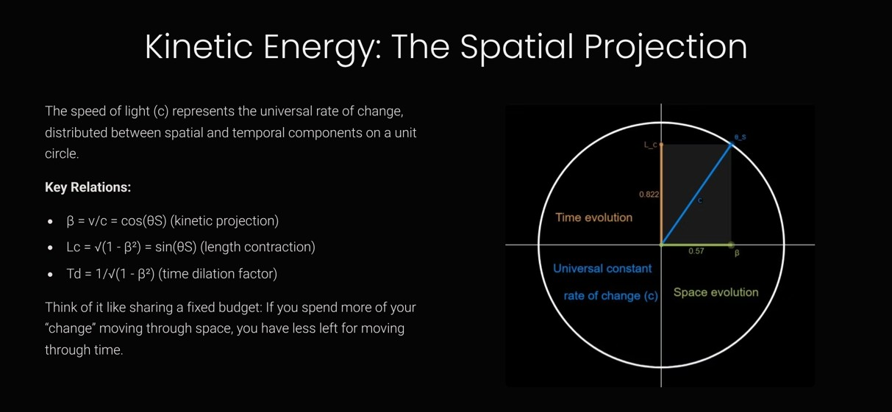
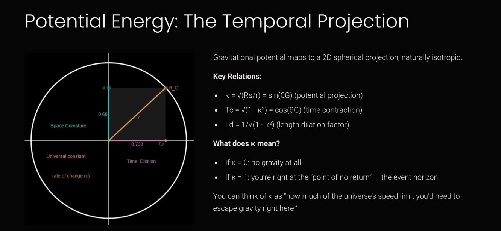

---

layout: default  
title: "Relativistic Foundations"

---

# Shape of Energy: A Narrative Exposition of WILL Geometry

---

## What is This Page?

This interactive page was created to **explain the essential meaning and logic of the WILL Geometry model** — but **without** the heavy mathematical machinery.

Here, the focus is on the core ideas, intuitive explanations, and geometric visualizations, making this new approach to fundamental physics accessible to a much wider audience.

If you want to see the full mathematical derivations, download the complete documents here:  
[Full WILL Geometry Papers](https://antonrize.github.io/WILL/parts/)

---

 
 Show Video Introduction 
 
 <iframe src="https://www.youtube.com/embed/XejFET7NgUs?si=o2olTsRgm\_BT\_A3r" title="YouTube video player" allow="accelerometer; autoplay; clipboard-write; encrypted-media; gyroscope; picture-in-picture; web-share" allowfullscreen> </iframe> 
 

---

<iframe style="border-radius:12px" src="https://open.spotify.com/embed/episode/5nOJdWgDAYVhM6g85Z1CWW" width="100%" height="232" frameborder="0" allow="autoplay; clipboard-write; encrypted-media; fullscreen; picture-in-picture" loading="lazy"> </iframe>

---

---

## Section 1: The Universe from a Single Principle

Modern theoretical physics is a magnificent edifice built on the foundation of astonishing predictive power. Theories of relativity and quantum mechanics describe the world with incredible precision, from subatomic particles to cosmic horizons. Yet, in this very foundation, there remain enigmatic elements that cast a shadow over the completeness of our understanding: gravitational singularities where known laws break down; arbitrary constants we can measure but cannot explain; and the necessity to introduce “dark” entities such as dark matter and dark energy simply to align theory with observation. These phenomena indicate that our description of reality may be incomplete.

Against this backdrop, a fundamental question arises: What if we could construct the Universe without any “extraneous details”? What if all observable phenomena—space, time, mass, energy—could be derived from a single, simple, and self-evident statement, without the need for free parameters or inexplicable constants? This approach—what might be called the principle of “epistemological hygiene”—demands that we reject all assumptions not strictly necessary, and build the theory solely on the basis of logical sequence.

---

---

It is on this path of uncompromising minimalism that the central, unifying postulate of WILL Geometry is born:

> **SPACETIME ≡ ENERGY EVOLUTION**

At first glance, this statement appears simple, but it carries a revolutionary meaning. It asserts that space and time are not some pre-existing “container” or stage on which physical processes unfold. On the contrary, the very fabric of spacetime is identical to the full structure of all possible transitions and interconnections between energetic states. Spacetime is not a stage; it is the dance itself. Energy does not exist in spacetime; rather, it defines it through its own projections and relations.

This work is not merely a reformulation of existing theories, but rather a narrative account of this new perspective—born from a personal quest to understand the fundamental nature of reality based on the most elementary geometric principles. It is an intellectual journey motivated by the conviction that the Universe’s structure must, at its core, be simple, elegant, and logically closed. The aim of this narrative is not to refute established physics, but to offer a deeper perspective—showing how the known laws of special and general relativity can be not merely postulated, but *derived* as inevitable consequences of a single, more fundamental principle. We will trace the logical chain from this lone postulate to its ultimate conclusions, demonstrating how it gives rise to all the complexity and beauty of the relativistic world.

---

## Section 2: The Rules of the Game — A Foundation of Pure Logic

If we accept the fundamental postulate—that spacetime is identical to energy evolution—we are immediately confronted with its strict logical consequences. First and foremost: if all of reality is a self-sufficient system of energetic relations, then by definition nothing can exist “outside” this system. There is no external observer, no absolute reference frame or background on which events unfold. The Universe of WILL Geometry must be entirely closed and self-sufficient.

This restriction, philosophical at first glance, generates concrete physical and geometric “rules of the game”:

-   **Conservation Law:** In a closed system, nothing can appear from outside or disappear without a trace. This means that the total energy of the system must be conserved. The law of conservation is not an added assumption, but a direct consequence of the Universe’s self-sufficiency.
    
-   **Symmetry:** In the absence of external reference points, no location in space and no direction can be privileged from the outset. Any asymmetry would require a preferred frame, contradicting our foundational principle. Therefore, the geometry of the Universe must be maximally symmetric.
    

---

---

This immediately raises the question: What geometric structures satisfy these strict requirements—being both closed and maximally symmetric? Mathematics gives a definitive answer. Among all possible manifolds, only certain forms possess these properties to perfection.

-   In one dimension, the only such form is the circle (`S¹`).
    
-   In two dimensions—the surface of a sphere (`S²`).
    

These geometries are not arbitrary choices or convenient models. They are forced upon us by the logic of the postulate itself. If the Universe is a closed and symmetric system of energetic relations, then any projections of those relations must “live” on these unique surfaces. The circle and the sphere become the only possible “canvases” on which the picture of physical reality can be drawn.

Finally, we must rethink one of the fundamental constants of nature—the speed of light, *c*. In WILL Geometry, *c* is not merely the speed at which photons travel. It is the universal speed of evolution, the fundamental tempo of change in the Universe itself. Every interaction, every transformation of energy, occurs at this single, invariant rate. This universal “speed of evolution” is like a vector of constant length. The various physical processes we observe are merely projections of this single vector onto different axes, just as a car’s velocity can be decomposed into northward and eastward motion. The sum of the squares of the projections always remains constant, naturally returning us to the geometry of the circle, where the radius (*c*) is invariant.

Thus, from a single postulate, we derive the entire set of rules: conservation, symmetry, and specific geometric structures (the circle and the sphere) that will serve as the arena for all subsequent physical phenomena. Geometry is not imposed upon physics; it is its inevitable logical consequence.

---

## Section 3: Motion on a Circle — Special Relativity Reimagined

With the rules of the game established, the next logical step is to examine the most basic process: uniform motion in a straight line. In WILL Geometry even this simple case must unfold on a closed, symmetric shape, because no external frame or boundary is allowed. The only one‑dimensional geometry meeting that requirement is a circle. We therefore imagine a unit circle whose radius represents the full, un‑split “speed of change” — the invariant speed of light *c*, which we set to 1 for convenience.

Every possible state of motion can be viewed as a point on the circumference of this circle. A radius drawn from the center to that point is a state‑vector describing how the total change splits between spatial motion and temporal progression. The vector’s fixed length encodes the fact that the speed of change is a universal constant. Its horizontal (space) and vertical (time) projections tell us how much of the available change is being “spent” on motion through space versus movement through time.

The dimensionless number **β (beta)** measures the fraction of this universal change that goes into spatial motion. By definition β = v/c, so β = 0 corresponds to rest relative to us and β ≈ 1 corresponds to motion approaching light‑speed. As β increases, the state‑vector leans farther along the spatial axis, leaving less of it pointing upward along the time axis. Because the vector’s length is fixed, the projections obey a Pythagorean relation: the faster you travel through space, the smaller your time component must be. This geometric trade‑off is the essence of time dilation and length contraction; there is nothing mystical about it — it follows directly from the geometry of a circle.

Even the famous relation **E = m c²** falls out naturally from this picture. When an object is at rest, all of its energy lies along the time axis — its *rest energy*, equal to m c². As the object accelerates, some of its energy rotates into the spatial direction and manifests as momentum. The total energy is the hypotenuse of the right triangle formed by rest energy and momentum (converted to energy units *p c*). To keep the hypotenuse length constant as β increases, the total energy must grow. This yields the energy–momentum relation $E^2 = (p c)^2 + (m c^2)^2$. Mass, momentum and energy are therefore not separate ingredients but orthogonal legs of a single geometric triangle.

---

---

 
 ▶ Show Interactive Graph: Motion/Time on the Unit Circle (Desmos) 
 
 
 <iframe src="https://www.desmos.com/geometry/mpdksbsf9q" width="100%" height="500" frameborder="0"></iframe> 
 
 

---

<!-- ### How Motion and Time Are Just Two Sides of the Same Thing Imagine all possible states of movement as points around a perfect circle. The \*radius\* of this circle is the fastest possible speed in the universe — the universal “speed of change.” Every moving object is like a pointer from the center of the circle to some spot on its edge. - \*\*Movement:\*\* How fast something moves through space is just “how much” of that pointer is aimed sideways around the circle. The faster it goes, the more it “leans” into space, and the less is left “pointing” upward — toward time. - \*\*Time:\*\* How fast time ticks for something is just “how much” of that pointer is aimed along the time direction. If the object speeds up through space, less of the pointer is left for time — so its time slows down. Think of it like sharing a fixed budget: If you spend more of your “change” moving through space, you have less left for moving through time. --> 
 
<strong>Show the math</strong>

The relationship between space and time projections is just Pythagoras’ theorem for a unit circle:  
   
$ \\beta = \\frac{v}{c} = cos(\\theta\_S) $ Kinetic projection  
   
$ L\_c = sin(θ\_S) = \\sqrt{1 − \\beta^2} $ Length contraction factor

 <!-- ### Why This Explains All the Weirdness of Relativity When you look at it this way, all the “strange” effects of special relativity — like time slowing down as you go faster — are just the result of keeping the total “speed of change” fixed, but sharing it differently between space and time. There’s nothing mysterious: - More speed through space = less speed through time. --> 
 
<strong>Show the math</strong>

The time slowdown (Lorentz factor) is:  
   
$ T\_{d} = \\frac{1}{L\_{c}} = \\frac{1}{\\sqrt{1- \\beta^2}} = 1/sin(θ\_S) $ Time dialation  
or  
$ \\gamma = \\frac{1}{\\sqrt{1 - v²/c²}}$

---

<!-- ### How E = mc² Falls Out Naturally Here’s the coolest part: That famous equation, E = mc², isn’t some magic law — it’s just what you get when you realize energy and mass are two sides of the same coin. At rest, all of an object’s energy points along the time direction. When it moves, some energy “tilts” into space — but the total stays balanced, so that the piece along time remains constant. - \*\*Mass\*\* is just a way to relate an object’s energy at rest to its fundamental “speed of change.” - \*\*Energy\*\* increases as the object moves, simply to keep the system in balance. --> 
 
<strong>Show the math</strong>

Total energy: E = γmc²  
   
Rest energy: E₀ = mc²  
   
Momentum: p = γmv

---

### The Energy-Momentum Triangle

> **A Guide to Interpreting This Combined Diagram:**
> 
> This diagram intentionally superimposes two different geometric views to illustrate their deep connection. To avoid confusion, please read the following guide:
> 
> 1.  **The Background (Unit Circle):** The white unit circle and its associated labels (like `L_c`, `θ_S`, and "Time evolution") represent the 'Spacetime Projection' model discussed previously. It is shown here as a **reference** to illustrate where the fundamental velocity parameter `β` originates. In this background view, the hypotenuse is always constant (equal to 1).
>     
> 2.  **The Foreground (Energy Triangle):** The shaded triangle is the main subject of this section. For this **Energy-Momentum Triangle**, the axes take on a new, physical meaning:
>     
>     -   The **vertical axis** represents the constant **Invariant Rest Energy ($E\_0$)**.
>         
>     -   The **horizontal axis** represents the growing **Momentum ($p$)**.
>         
> 
> The hypotenuse of this main triangle represents the growing **Total Energy ($E$)**, which clearly extends beyond the bounds of the background unit circle.
> 
> The key takeaway is to see how the parameter `β` from the reference circle is used to construct the much larger energy-momentum triangle, visually linking the geometry of spacetime to the energy of an object.

**Visualize energy, mass, and momentum as a simple right triangle:**

-   **One side** (fixed) always represents the object's *rest energy* — this never changes, no matter how fast it moves.
    
-   **The second side** grows as the object’s speed increases — this is its *momentum*.
    
-   **The hypotenuse** is the *total energy* — it stretches as you go faster.
    

---

---

> When you slide the velocity, you can see how “momentum” grows, and total energy stretches to keep the triangle in perfect balance, but rest energy always stays the same.

---

The energy–momentum triangle conveys an important message: you cannot assign energies and momenta independently. The vertical leg represents the invariant rest energy, the horizontal leg the momentum (which grows with velocity), and the hypotenuse the total energy. These three are bound by the Pythagorean relation $E^2 = (p c)^2 + (m c^2)^2$, so no matter how fast you go the triangle remains intact – rest energy stays constant, momentum grows, and total energy stretches to accommodate both.

 
<strong>Show the math</strong>

The energy–momentum relation:

$$
E^2 = (p c)^2 + (m_0 c^2)^2
$$

where $E$ is the total energy, $p$ is the momentum and $m\_0 c^2$ is the rest energy.

---

 
 ▶ Show Interactive Graph: The Energy-Momentum Triangle (Desmos) 
 
 
 <iframe src="https://www.desmos.com/geometry/ezmytl5lkh" width="100%" height="500" frameborder="0"></iframe> 
 
 

---

### What This Means

Special relativity stops being a bunch of rules about “strange time effects” or “postulates about light.” Instead, it’s just a simple story of how all things must share a fixed “budget” of change between motion and time. Mass, energy, and momentum are simply three perspectives on the same underlying geometric fact.

---

## Section 4: Gravity on a Sphere — General Relativity Reimagined

Having understood how uniform motion naturally lives on a circle, we now turn to the second great manifestation of relativity: gravity. Unlike motion, gravity does not act along a single direction; it emanates symmetrically from massive bodies. The only closed, maximally symmetric two‑dimensional geometry is a sphere, so gravitational effects must be represented on a sphere. Picture yourself at the center of a sphere of possible positions relative to a massive object. Your location on this sphere, defined by the radius, determines the strength of the gravitational influence you feel.

---

### How Gravity Is Described on the Sphere

In this spherical picture, we introduce a new dimensionless parameter **κ (kappa)** to quantify how deep a given point lies within a gravitational field. By definition κ ranges from 0 to 1. κ = 0 corresponds to negligible gravity far from any mass, while κ = 1 corresponds to the event horizon of a black hole, where the escape speed equals the universal speed of change. Intermediate values of κ measure the fraction of the universal speed required to escape from your location. For example, κ = 0.5 means you would need to reach 50% of light speed to break free of the gravitational pull at that position.

Because gravity spreads evenly in all directions, κ is a measure of the “depth” into the gravitational potential well. Everyday situations on Earth correspond to very small κ, while extreme astrophysical scenarios (neutron stars and black holes) correspond to κ approaching unity. You can interpret κ as your personal “gravitational depth gauge” — a ruler marking how far down a two‑dimensional sphere you are from the zero‑gravity pole toward the black‑hole equator.

---

### Gravitational Time Dilation

Just as motion splits the state‑vector between space and time on the circle, gravity splits it on the sphere. When you are deeper in a gravitational potential (higher κ), part of your universal change budget is “spent” on being at that depth. As a result, less of the vector is available to project along the time axis. In other words, **the deeper you are in a gravity well, the slower your time component becomes**. This effect is quantified by exactly the same kind of expression we encountered for motion: the rate at which time flows at a given κ is proportional to $\sqrt{1 - \kappa^2}$. At the event horizon (κ = 1) the time projection goes to zero from an outside perspective, meaning time appears to freeze at the horizon.

This deep correspondence shows that gravitational time dilation and motion‑induced time dilation share the same mathematical structure. Both follow a Pythagorean law on their respective geometric canvases — a circle for motion and a sphere for gravity.

---

---

> Gravity does not merely pull objects inward; it literally alters the rate at which clocks tick depending on where you are relative to the mass. The deeper you descend into a gravitational well, the more slowly your time flows relative to distant observers.

 
<strong>Show the math</strong>

Time dilation in a gravitational field is given by:

$$
\sqrt{1 - \kappa^2} = \sqrt{1 - \frac{R_S}{r}} = \sqrt{1 - \frac{2 G M}{r c^2}}
$$
 

---

 
 ▶ Show Interactive Graph: Gravity as a Shadow on the Sphere (Desmos) 
 
 
 <iframe src="https://www.desmos.com/geometry/ifeyu1yg2b" width="100%" height="500" frameborder="0"></iframe> 
 
 

---

### The Hidden Symmetry

Here’s the coolest part:

-   Time-slowing by *moving fast* (special relativity) and by *being near gravity* (general relativity) are really the SAME effect, just from different geometric “views.”
    
-   Both are about how much of your “change budget” gets “spent” in different directions.
    

| Situation | Geometry | Time Slowdown Formula |
| --- | --- | --- |
| **Moving fast (SR)** | Circle | `√(1−β²)` |
| **Near mass (GR)** | Sphere | `√(1−κ²)` |

So, what looks like two separate “mysteries” in physics are actually just two projections of the same fundamental story.

---

## Section 5: Energy as a Relation — What κ and β Actually Mean

### Key Principle:

**Energy isn't something objects "have"—it's a measure of differences between states.**

When we drop anthropocentric distortions, a clear and intuitive picture emerges:

-   Physical parameters like energy, speed, and gravitational potential don't belong to objects.
    
-   Instead, they represent how we, as observers, measure differences from our own point of view.
    

In this relational view, your perspective is always the reference frame. You are always at zero. Everything else is described by how it differs from your state:

-   **β (Beta)** is not an intrinsic property of a moving object. It is a measure of how much of the universal "speed of change" you see as motion through space, relative to yourself.
    
-   **κ (Kappa)** doesn't describe an object's "stored" gravitational energy. It measures how deeply an object sits in a gravitational field, as seen from your position. It's your personal "ruler" for gravitational depth.
    

Think of κ and β as your own relational measuring tools:

-   **β** is how far along your "motion ruler" you project another object's state.
    
-   **κ** is how deep into your "gravity well" you see another object's state.
    

Energy thus emerges naturally:

-   Energy is simply the capacity to move between states—it's not possessed, but relationally defined.
    
-   Saying "the object's energy" always implicitly means "the object's energy as measured from your perspective."
    

Here's a simple analogy:

> Imagine standing on a train platform. A train passes by rapidly: to you, it has significant kinetic energy. But if you jump onto the train, it instantly becomes stationary relative to you. Its kinetic energy is now zero—because your frame of reference shifted. The energy didn't vanish; your perspective changed.

**Bottom line:**

-   Energy, κ, and β aren't hidden intrinsic qualities; they're your personal, relational measurements.
    
-   All physics boils down to describing how things differ from your chosen point of view. No more, no less.
    

---

## Section 6: Unification – When the Circle Meets the Sphere

Now comes the punchline: All this time, we’ve seen motion (special relativity) and gravity (general relativity) as separate “shadows” of the same underlying process, just playing out on different shapes — the circle and the sphere.

But here’s the twist: **these two worlds aren’t really separate.** In fact, there’s a deep, built‑in connection between them. They’re just different “faces” of one and the same thing.

---

### The Universal “Budget” Principle

Imagine you have a bucket of paint. You can use it to draw a line around a circle (one‑dimensional) —or— you can use it to cover the surface of a sphere (two‑dimensional).

No matter how you use it, your total paint doesn’t change — but the way it “spreads” over these shapes is fundamentally different. This is exactly what happens with energy in the universe:

-   Sometimes it shows up as *motion* (moving around the circle)
    
-   Sometimes as *gravity* (spread over the sphere)
    

But both are just different ways of splitting up the same “energy budget.”

 
<strong>Show the key connection</strong>

The “paint” covering for both shapes leads to a simple rule:

$$
\kappa^2 = 2\beta^2
$$

or

$$
\frac{\kappa^2}{\beta^2} = 2
$$

where

-   β² = “share” spent on motion
    
-   κ² = “share” spent on gravity
    

---

---

#### Why does it matter?

-   This isn’t some made‑up or “fit” formula.
    
-   It pops out just from how geometry itself works — how lines and surfaces relate.
    
-   Even old-school physics quietly hinted at this (for example, the escape velocity in Newton’s gravity, $v\_e^2 = 2v\_{orb}^2$.
    

**Bottom line:** Motion and gravity are *two sides of the same coin*. Their relationship isn’t an accident — it’s a built-in, geometric law of how the universe splits up its “energy resources.” This is why they can’t ever be truly separated, and why geometry is the hidden glue in everything.

---

---

### Where Does the “2” Come From?

All this talk about “budgeting” between circles and spheres leads to a natural question: **Why exactly “2”? Where does it come from?**

Here’s the simple geometric truth:

-   The *circle* (our 1D case for motion) has a circumference of **2π** (for a unit radius).
    
-   The *sphere* (our 2D case for gravity) has a surface area of **4π** (for a unit radius).
    

So when we ask, “How many times does a circle fit into a sphere?” the answer is:

 
<strong>Show the calculation</strong>
 $$ \\frac{\\text{Surface area of sphere}}{\\text{Circumference of circle}} = \\frac{4\\pi}{2\\pi} = 2 $$ 

That’s the source of the mysterious “2” in our key equation. It’s not an arbitrary fudge factor — it’s pure geometry.

---

### How It Ties Together

So when energy splits between motion (on the circle) and gravity (on the sphere), the “budget” gets shared according to this built-in, topological ratio. The key relationship:

$$
\kappa^2 = 2\beta^2
$$

just says: *“Gravity’s share is always twice the motion’s share, because a sphere’s surface area is twice the length of a circle’s perimeter, at the most fundamental geometric level.”*

**In short:** The “2” isn’t magic, it’s the deep fingerprint of geometry itself, forever tying together movement and gravity in the universe.

---

### The Photon Sphere: A Point of Perfect Balance

A remarkable consequence of this unification happens at a special “balance point” — where the two projections, kinetic and potential, are perfectly matched. This occurs when:

$$
\kappa^2 + \beta^2 = 1
$$

and the two angles are exactly equal.

---

 
 ▶ Show Interactive Graph: Q Circle (Desmos) 
 
 
 <iframe src="https://www.desmos.com/geometry/vo5xxlcglf" width="100%" height="500" frameborder="0"></iframe> 
 
 

---

**At this moment, something amazing appears: it matches the “photon sphere” — the special zone around a massive object where light itself can orbit in a perfect circle.** (For a black hole, that’s at a distance of 1.5 times its radius.)

 
<strong>What happens to light at the photon sphere?</strong>
 At the photon sphere, a photon moving exactly along the perfect circle could orbit forever — but this path is incredibly unstable. If the photon’s path points even a tiny bit outward, it escapes to infinity. If it’s angled a bit inward, it falls into the black hole. So, the photon sphere is not a prison — it’s a tightrope. Light can still escape if it’s not traveling exactly along the circle. 

---

## Section 7: Energy–Symmetry Law (Why No Free Lunch)

### The Big Idea

Whenever you compare two observers (say, someone on the ground and someone in orbit), **the energy differences they see will always perfectly balance out.** No matter how you swap perspectives — nobody ever gets “extra” energy for free. This is the universe’s built-in law of energetic fairness.

---

### How it Works (Without Math)

Imagine:

-   Observer **A** is standing on the ground.
    
-   Observer **B** is orbiting above.
    

If an object moves from A (the ground) up to B (orbit):

-   It has to *fight gravity* (gaining potential energy).
    
-   It needs to *speed up* (gaining kinetic energy).
    

From B’s point of view, if the object comes *down*:

-   It *drops* into stronger gravity (loses potential energy).
    
-   It *slows down* to rest (loses kinetic energy).
    

**But if you add up both “energy stories,” the total change is always zero.**

> The universe never “creates” or “loses” energy when you swap perspectives — just moves it around.

 
<strong>Show the math</strong>
 $$ \\Delta E\_{A \\to B} + \\Delta E\_{B \\to A} = 0 $$ 
$$
E_{A \to B}=\frac{1}{2}((\kappa_{A}^{2}-\kappa_{B}^{2})+\beta_{B}^{2})
$$
 
$$
E_{B \to A}=\frac{1}{2}((\kappa_{B}^{2}-\kappa_{A}^{2})-\beta_{B}^{2})
$$
 
$$
E_{SYMETRY}=E_{A \to B}+E_{B \to A}=0
$$

Each transfer includes both gravitational ($κ^2$) and kinetic ($β^2$) parts, always balancing out.

---

---

### Universal Speed Limit: Why Nothing Goes Faster than Light

This “energy symmetry” is so strict that it naturally sets the universe’s ultimate speed limit.

-   If something *could* go faster than light, the balance would be broken — one observer would see “extra” energy appear out of nowhere.
    
-   That’s not allowed: **causality and energy symmetry would both collapse.**
    
-   So, the speed of light isn’t just a cosmic “speed trap” — it’s the built-in edge of energetic fairness.
    

 
<strong>Math explanation</strong>

Assume an object could exceed the speed of light ($ \\beta > 1$). In that scenario:

-   The kinetic component ($\\beta$) surpasses unity excessively, causing an irreversible imbalance in energy transfer.
    
-   No reciprocal transfer could balance this energy, breaking the fundamental symmetry:
    

\\begin{equation}  
\\Delta E\_{A \\to B} + \\Delta E\_{B \\to A} \\neq 0  
\\end{equation}  
Thus, $ \\beta \\leq 1$ ($v \\leq c$) is required intrinsically to preserve causal and energetic consistency.

**In plain English:**

-   The universe is like the world’s most perfect accountant: every bit of energy spent or gained in one place is balanced by what’s lost or gained elsewhere.
    
-   The speed of light is where this balance can just barely be maintained — go past it, and the rules snap.
    

---

## The Universe in One Equation

From our logical starting point we arrive at a remarkable climax: the entire structure of spacetime and energy can be encapsulated in a single algebraic relation. This unified field equation ties together geometry and energy content with stunning simplicity.

 
<strong>See the Universe's one‑line code</strong>
 $$ \\kappa^2 = \\frac{R\_s}{r\_d} = \\frac{\\rho}{\\rho\_{\\max}} $$ 

At any location in the universe, the fraction of the critical radius reached (how close you are to forming a black hole), the fraction of the maximum permissible energy density filled, and the square of the gravitational “depth” κ are all the same number. You cannot arbitrarily raise the energy density or shrink the radius without all three ratios adjusting together. Nature always keeps geometry and energy in lockstep, no matter whether you describe a situation in terms of distance from the centre or in terms of local energy density.

This deceptively compact statement carries profound implications. It means that at every point in space there is a built‑in capacity for how much energy can reside there. We call this the **critical density**, and it depends on your distance $r\_d$ from a mass. The closer you are to the centre, the higher the limit becomes, but it never diverges. The relation $\\rho\_{\\max} = c^2/(8\\pi G r\_d^2)$ tells us that space can handle ever greater energy densities as it narrows, but there is always a cap.

 
<strong>How is the density limit set?</strong>
 $$ \\rho\_{\\max} = \\frac{c^2}{8\\pi G r\_d^2} $$

A smaller radius allows a larger energy density – but there is always a ceiling.

The unified equation has two dramatic consequences. First, it forbids the infinite densities (singularities) that plague classical general relativity. Instead of allowing spacetime to collapse into a point of infinite curvature and undefined physics, WILL Geometry imposes a finite maximum density everywhere. Black holes become regions where energy is packed to the allowed maximum but never beyond, so the mathematics remains well‑behaved. Second, it shows that geometry and energy are not merely related by complicated differential equations but are literally two expressions of the same thing: you can express a situation either in terms of radius or in terms of density, and the fractions line up exactly.

|  | **Einstein’s General Relativity** | **WILL Geometry** |
| --- | --- | --- |
| **Geometry–Energy relation** | Indirect via coupled field equations | Direct algebraic identity; one expression for all |
| **Mathematical formalism** | Tensor calculus and curvature | Simple geometric projections |
| **Singularities** | Predicted in extreme conditions | Forbidden; density is always finite |
| **Density limit** | Undefined; requires quantum corrections | Explicitly defined and position‑dependent |

These differences highlight the appeal of the WILL approach. By condensing the content of Einstein’s field equations into one line, we recover the same phenomena while avoiding pathologies. **Geometry, energy content and density always remain in sync; there is always a local limit; and no infinities or breakdowns appear.**

The one‑line field equation also completes a logical loop: we began with the postulate that spacetime is nothing but energy evolution, and by following geometric reasoning we derived an equation that asserts exactly the same thing in mathematical form. This closure – sometimes nicknamed the “Theoretical Ouroboros” – shows that the postulate leads inevitably to an equation that in turn encapsulates the postulate. It is rare in theoretical physics to find such tight self‑consistency.

## Testing the Vision – GPS and Mercury

A theory lives or dies by experiment. To establish that the unified geometric picture is more than a philosophical exercise, it must reproduce the precise relativistic effects we observe in the world. Two classic tests provide rigorous benchmarks: the time shifts required for GPS satellites to function, and the anomalous precession of Mercury’s orbit. Each effect has been measured with high precision. WILL Geometry meets these tests by deriving both results from the same unified formalism.

---

---

### 1\. Time Correction in the GPS System

The Global Positioning System (GPS) is perhaps the ideal laboratory for testing relativistic effects in everyday life. For the system to function with high accuracy, GPS satellites must account for two relativistic effects that influence the rate of their onboard clocks compared to clocks on Earth:

-   **Special Relativity (SR) effect:** Satellites move at high speed (about 3.87 km/s), which causes their clocks to run slower than those on Earth. This effect is described by our kinetic projection β.
    
-   **General Relativity (GR) effect:** Satellites are at high altitude (about 20,200 km), where Earth's gravitational field is weaker. This causes their clocks to run faster than those on Earth. This effect is described by our potential projection κ.
    

The standard approach is to calculate these two corrections separately and sum them. WILL Geometry offers a more fundamental approach. It asserts that these two effects are not independent, but are linked by the unbreakable relation κ² = 2β² and can be combined into a single unified energetic parameter Q, where Q² = κ² + β². Using this single parameter to calculate the overall relativistic time shift for the Earth–satellite system, WILL Geometry predicts that the clocks on GPS satellites should run ahead of ground-based clocks by about **38 microseconds per day**.

This result exactly matches the empirically measured value that must be continually added to the GPS system for it to function correctly. The success of this prediction is a powerful confirmation not only of the individual parts of the theory, but—more importantly—of the very principle of unification. It shows that treating kinetic and gravitational effects as unified geometric projections is not just a theoretical sophistication but a practical necessity for arriving at the correct answer.

---

 
 ▶ Show Interactive Graph: Earth GPS (Desmos) 
 
 
 <iframe src="https://www.desmos.com/geometry/gfe2jpfh1g" width="100%" height="500" frameborder="0"></iframe> 
 
 

---

### 2\. Precession of Mercury’s Orbit

One of the earliest triumphs of Einstein’s general relativity was its explanation of the anomalous precession (slow rotation) of Mercury’s elliptical orbit. Observations showed that the perihelion (the point closest to the Sun) of Mercury’s orbit shifts by an additional 43 arcseconds per century, above what Newtonian gravity predicted.

WILL Geometry also faces this classic test. Using its fundamental equations and parameters (β and κ, calculated for Mercury in the gravitational field of the Sun), the theory allows us to compute the expected value of this relativistic precession. The result obtained within WILL Geometry matches both the GR prediction and the observed data with machine-level precision.

Detailed calculations for both examples are provided in this document, but the narrative conclusion is clear: WILL Geometry is not merely a philosophical construction. It passes the most rigorous experimental and observational tests. It not only reproduces the successes of standard relativistic physics but does so from deeper, more unified first principles, lending its predictions extra weight and elegance. A theory born of pure logic finds its exact reflection in the workings of the real world. WILL Geometry stands up to every challenge that nature throws at it, not just matching standard physics, but explaining it from the ground up, using nothing but logic and geometry.

---

 
 ▶ Show Interactive Graph: Sun–Mercury (Desmos) 
 
 
 <iframe src="https://www.desmos.com/geometry/hkxjqfkchp" width="100%" height="500" frameborder="0"></iframe> 
 
 

---

## Does Time Truly Flow? – A New View of Change

The most radical implication of the WILL framework lies in its treatment of time. In everyday physics we picture change unfolding against the backdrop of an independent river of time. We specify a system’s initial state and then apply equations to evolve that state step by step as time flows. Time is treated as an absolute parameter outside the system itself.

The relational view turns this picture on its head. There is no separate “river” of time; there is only a vast landscape of allowed states, each one satisfying the geometric and energetic balance laws. Change consists of moving from one balanced state to another. When something alters – for example, when a black hole accretes mass – all related quantities (radius, curvature, energy density) readjust instantaneously to maintain the fundamental relations. There is no waiting and no continuous flow; the system jumps from one self‑consistent configuration to the next.

In this light, **time is merely a label we assign to the ordering of these states**. It does not drive change; rather, change defines what we call time. Physics becomes a study not of how things evolve within time, but of which sequences of states are permitted by the balance equations.

This inversion matters deeply. It flips our intuition: dynamics are not about trajectories through time but about paths through a network of possible states. It also hints at a resolution of the “problem of time” in quantum gravity, where time stubbornly refuses to fit into a quantum framework. By demoting time to an emergent concept, WILL Geometry suggests that a timeless description of the universe is both possible and coherent. In practical terms, however, we can continue to use time as a convenient bookkeeping parameter to describe how one self‑consistent state leads to another.

The bottom line is that the universe, in this view, is not a machine grinding away inside time. It is a perfectly balanced structure continuously reshaping itself. “Time” is simply the narrative we construct about those perpetual rebalancings.

---

## Conclusion – When Space Emerges from Energy

Our journey through the relativistic foundations of WILL Geometry brings us back to the central insight: spacetime is nothing more than energy in motion. By pushing that idea through geometric reasoning, we have rederived special and general relativity as shadows cast on a circle and a sphere, unified motion and gravity through a simple topological ratio, and avoided the infinities that trouble classical theories. Along the way we saw how energy must be understood relationally and how the cosmic speed limit emerges from perfect energy bookkeeping. Even the flow of time itself became an emergent label for a sequence of balanced states.

Several themes stand out:

-   **Relativity reinterpreted:** Instead of starting with postulates about the speed of light or the equivalence principle, the familiar effects of time dilation, length contraction and $E = m c^2$ fall naturally from sharing a fixed change‑vector between motion and time.
    
-   **Deep unification:** Motion and gravity are not separate realms but complementary ways of allocating one energy budget. The factor of two linking their projections arises directly from the ratio of a sphere to a circle.
    
-   **Natural limits:** The speed of light emerges not as a mysterious universal constant but as the boundary beyond which energetic symmetry would be violated.
    
-   **No singularities:** Because there is always a finite density limit, black holes are the densest allowable states, not points of infinite curvature.
    
-   **Time reimagined:** Change defines time, not vice versa. The universe is a network of possible states adjusting to maintain balance; what we call “time” is our narrative of that adjustment.
    

At the core of this framework is the bold claim that **energy does not merely reside in space – it creates space by its projection**. All of physics becomes a study of the projective curvature of energy flow. The essence of this unification is captured in a single dimensionless invariant:

 
<strong>See the WILL invariant</strong>
 $$ W\_{ill} = \\frac{E \\cdot T^2}{M \\cdot L^2} = \\frac{L\_d\\,E\_0\\,T\_c\\,t\_{d}^{2}}{T\_d\\,m\_0\\,L\_c\\,r\_{d}^{2}}= \\frac{\\frac{1}{\\sqrt{1-\\kappa^{2}}}m\_{0}c^{2}\\cdot\\sqrt{1-\\kappa^{2}}\\left(\\frac{2Gm\_{0}}{\\kappa^{2}c^{3}}\\right)^{2}}{\\frac{1}{\\sqrt{1-\\beta^{2}}}m\_{0}\\cdot\\sqrt{1-\\beta^{2}}\\left(\\frac{2Gm\_{0}}{\\kappa^{2}c^{2}}\\right)^{2}}=1 $$ 

Energy, mass, time and length are not disconnected ideas, but tightly bound faces of a single self‑consistent structure.

The name **WILL** reflects both the harmonious unity of the framework and a subtle irony towards the anthropic principle, which often intertwines human existence with cosmic causality. Here, the equation stands as a testament to universal laws that transcend any human‑centred interpretation.

This is not the end but just a beginning. The same first principles are being extended to cosmology and quantum mechanics, with results and detailed applications available here:

---

-   [WILL Geometry — Full Papers & Results](https://antonrize.github.io/WILL/parts/)
    
-   [Results & Applications](https://antonrize.github.io/WILL/results/)
    

---
