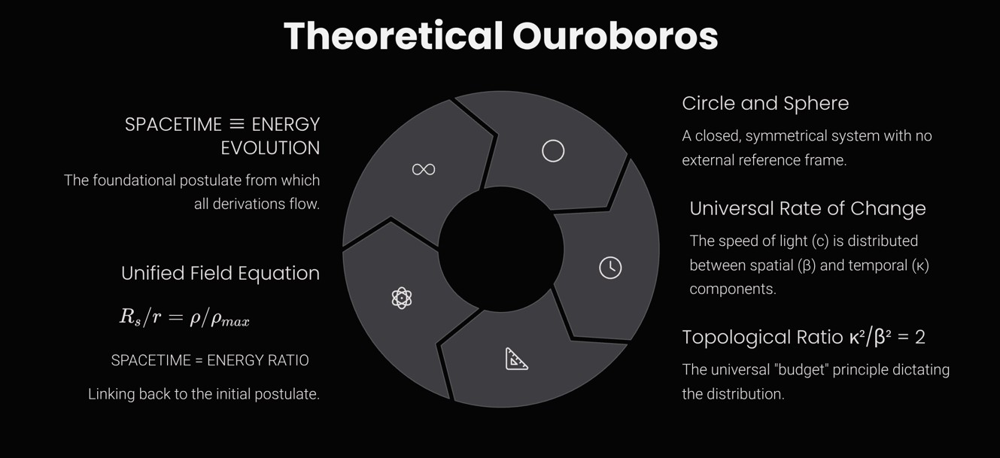

---  

layout: default  
title: "Relativistic Foundations" 

---  

 

# WILL Part I: Relational Geometry

---

## What is This Page?

This interactive page was created to **explain the essential meaning and logic of the WILL Geometry model** — but **without** the heavy mathematical machinery.

Here, the focus is on the core ideas, intuitive explanations, and geometric visualizations, making this new approach to fundamental physics accessible to a much wider audience (hover-tooltips added for clarity).

If you want to see the full mathematical derivations, download the complete documents here:  
[Full WILL Geometry Papers](https://antonrize.github.io/WILL/parts/)

---

  
  
▶ Quick Glossary: Key Terms & Concepts
  
  
  
    
<strong>Beta (β):</strong>  The kinetic <abbr title="mapping of one quantity onto another axis or dimension">projection</abbr>. Representing the ratio of an object's velocity to the universal speed of evolution (β = v/c). It quantifies how much of the "speed of change" is perceived as motion through space relative to observer. Not an intrinsic property of an object but rather a measure of the differences between states, perceived from the perspective of an observer.
  
    
<strong>Kappa (κ):</strong>  The potential <abbr title="mapping of one quantity onto another axis or dimension">projection</abbr>. It measures how deeply an object is situated within a gravitational field, relative to an observer, and asociated with <abbr title="The speed object has to move to escape the gravitational field">escape velocity</abbr>  (κ = v_e/c). It indicates proximity to an event horizon, at κ = 1 object has to move with the speed of light (c) in order to escape gravity (event horizon). Not an intrinsic property of an object but rather a measure of the differences between states, perceived from the perspective of an observer.
  
    
<strong>Universal Speed of Evolution (c):</strong> Another name for the speed of light, viewed here as the fundamental, <abbr title="a quantity that remains unchanged under transformations">invariant</abbr> tempo of change in the universe. It is not merely the speed of light but the constant rate at which all energetic interactions and transformations occur, speed limit for any change or information transfer.
  
    
<strong>Epistemological Hygiene:</strong> The principle of removing all unnecessary assumptions when building a theory, using only what’s logically required (nothing extraneous).
  
    
<strong>Event Horizon:</strong> The boundary around a black hole beyond which nothing can escape. (At this “point of no return,” the escape velocity equals the speed of light.)
  
    
<strong>Photon Sphere:</strong> A region near a black hole (about 1.5 times the Schwarzschild radius) where light can orbit in a circle if moving tangentially. It's an unstable orbit – light can fall in or escape if perturbed.
  
    
<strong>Critical Density:</strong> The maximum energy density that can can be packed into a given radius, dependent on central mass and the distance from it center. It increases closer to a central mass but never becomes infinite, thus preventing the formation of infinite densities (singularities).
  
    
<strong>Singularity:</strong> A point of infinite density where conventional physics breaks down. Standard GR predicts singularities (e.g. inside black holes); WILL Geometry avoids them by enforcing a finite critical density.
  
    
<strong>Energy–<abbr title="a property of a system that remains unchanged under transformations">symmetry</abbr> Law:</strong> The rule that energy differences always balance out between perspectives. If one observer sees a gain, another sees an equal loss — preventing any “free” energy or causality violations (this also ensures a universal speed limit).
  
  
  

---

    
    

        

            This page explores a foundational model of physics built from a single principle. Instead of describing observed phenomena with external laws, it <strong class="text-white">generates the laws of physics</strong> as an inevitable consequence of that principle.
        

    

---

    
    

        

            To construct a theory from a single idea without introducing new postulates requires an uncompromising methodology. These pillars serve as the logical rules that guide the entire framework, ensuring no hidden assumptions or arbitrary constants are smuggled in.
        

    

---

    
    

        

            This approach follows a powerful historical pattern. The greatest leaps in physics have consistently come not from adding new entities, but from <strong class="text-white">removing a false separation</strong>. Just as Copernicus removed the Earth/cosmos divide and Einstein unified space and time, this framework targets the final, unexamined split in modern physics.
        

    

---

    
    

        

            The contemporary split is between the <strong class="text-white">structure</strong> of the universe (a fixed stage, or manifold) and the <strong class="text-white">dynamics</strong> that unfold upon it (fields and energy). This separation is not an empirical discovery but an implicit assumption—an "unpaid ontological debt". By removing it, we are forced to identify geometry and energy as two aspects of a single entity.
        

    

---

    
    

        

            These three constraints—<strong class="text-white">Closure, Conservation, and Isotropy</strong>—are immediate, unavoidable consequences of a universe built from a single, self-contained principle. The next crucial question is: what mathematical forms can possibly satisfy all these rigid requirements at once?
        

    

---

    
    
    

        

            <h4 class="font-semibold text-white">Lemma: Closure</h4>
            
Under Principle 4.1 (\(\text{SPACETIME} \equiv \text{ENERGY}\)), WILL is self-contained: there is no external reservoir into or from which the relational resource can flow.

        

        

            <h4 class="font-semibold text-white">Lemma: Conservation</h4>
            
Within WILL, the total relational "transformation resource" (energy) is conserved.

        

        

            <h4 class="font-semibold text-white">Lemma: Isotropy from Background-Free Relationality</h4>
            
If no external background is allowed, then no direction can be a priori privileged. Thus the admissible relational geometry of WILL must be maximally symmetric.

        

        

            <h4 class="font-semibold text-white">Theorem: Minimal Relational Carriers of the Conserved Resource</h4>
            
The only closed, maximally symmetric manifolds that can serve as minimal carriers of the conserved relational resource are:

            <ol class="list-decimal list-inside ml-4 mt-2">
                <li><strong class="text-white">\(S^1\)</strong> for <em>directional</em> (one-degree-of-freedom) relational transformation;</li>
                <li><strong class="text-white">\(S^2\)</strong> for <em>omnidirectional</em> (central, all-directions-equivalent) relational transformation.</li>
            </ol>
        

         

            
S¹ and S² are not spacetime geometries, but relational manifolds.

        

    

---

    
    

        

            Energy is the relational measure of difference between possible states, conserved in any closed whole.
          It is not an intrinsic property of an object, but comparative structure between states (and observers), always manifesting as transformation.
        

    

---

    

---

  
  
▶ Show Interactive Graph: Motion/Time on the Unit Circle (Desmos)
  
  
  
    
  
      <iframe src="https://www.desmos.com/geometry/mpdksbsf9q" width="100%" height="500" frameborder="0"></iframe>  
    
  
  
  

---

    
    

        <h3 class="text-2xl font-bold text-white mb-4">The Duality of Transformation</h3>
        
        

            <h4 class="font-semibold text-white">Lemma: Duality of Evolution</h4>
            
The identification of spacetime with energy and its transformations necessitates two complementary relational measures:

            <ol class="list-decimal list-inside ml-4 mt-2">
                <li>the <strong>extent</strong> of transformation (external displacement), and</li>
                <li>the <strong>sequence</strong> of transformation (internal order).</li>
            </ol>
        

        

            <h4 class="font-semibold text-white">Proof</h4>
            
Any complete description of transformation must specify both what changes and how that change is internally ordered. A single measure cannot capture both. The circle \(S^1\) provides the minimal geometry enforcing such complementarity: its orthogonal projections furnish precisely two non-redundant coordinates.

        

        
We define these orthogonal projections as follows:

        <ul class="list-disc list-inside ml-4 mt-2 space-y-2">
            <li><strong>The Amplitude Component (\(\beta_X\)):</strong> This projection represents the <em>relational measure</em> between the system and the observer. It corresponds to the <em>extent</em> of transformation, which manifests physically as momentum.</li>
            <li><strong>The Phase Component (\(\beta_Y\)):</strong> This projection represents the <em>internal structure</em> of a system. It governs the intrinsic scale of its proper space and proper time units, corresponding to the <em>sequence</em> of its transformation. A value of \(\beta_Y=1\) represents a complete and undisturbed manifestation of this internal structure, a state we identify as rest.</li>
        </ul>

        <h3 class="text-2xl font-bold text-white mt-10 mb-4">Conservation Law of Relational Transformation</h3>

        

            <h4 class="font-semibold text-white">Theorem: Conservation Law of Relational Transformation</h4>
            
The orthogonal components of transformation (\(\beta_X,\beta_Y\)) are bound by the closure relation:

            
\(\beta_X^2 + \beta_Y^2 = 1\)

        

        

            <h4 class="font-semibold text-white">Proof</h4>
            
Since \(S^1\) is closed, every point on the circle is constrained by the Pythagorean identity of its projections. Thus no state can exceed or fall short of the finite relational "budget." This closure enforces conservation across all processes.

        

        <h3 class="text-2xl font-bold text-white mt-10 mb-4">Consequence: Relativistic Effects</h3>

        

            <h4 class="font-semibold text-white">Proposition: Physical Interpretation: Relativistic Effects</h4>
            
The conservation law implies that any redistribution between the orthogonal components (\(\beta_X,\beta_Y\)) manifests physically as the relativistic effects of time dilation and length contraction.

        

        

            <h4 class="font-semibold text-white">Proof</h4>
            
The components satisfy \(\beta_X^2 + \beta_Y^2 = 1\). An increase in the relational displacement \(\beta_X\) enforces a decrease in the internal measure \(\beta_Y\). This reduction of \(\beta_Y\) corresponds to dilation of proper time and contraction of proper length, while the growth of \(\beta_X\) represents momentum. Thus the relativistic trade-off is the direct physical expression of the geometric closure of \(S^1\).

        

        

            
The geometry of spacetime is the shadow cast by the geometry of relations.

        

    

---

    

---

    
    

        <h2 class="text-3xl font-bold text-white text-center mb-6">Kinetic Energy Projection on \(S^1\)</h2>
        
Since \(S^{1}\) encodes one-dimensional displacement, the total energy \(E\) of the system must project consistently onto both axes:

        
\(E_{X} = E \beta_{X}, \qquad E_{Y} = E \beta_{Y}\)

        

            <h4 class="font-semibold text-white">Theorem: Invariant Projection of Rest Energy</h4>
            
For any state (\(\beta_X, \beta_Y\)) on the relational circle, the vertical projection of the total energy is invariant:

            
\(E \beta_Y = E_0\)

        

        

            <h4 class="font-semibold text-white">Proof</h4>
            
When \(\beta_X=0\), closure enforces \(\beta_Y=1\), yielding \(E=E_0\). Since closure applies for all \(\theta_1\), the vertical projection \(E\beta_Y\) remains equal to this rest value in every state.

        

        

            <h4 class="font-semibold text-white">Corollary: Total Energy Relation</h4>
            
From the theorem it follows that:

            
\(E = \frac{E_0}{\beta_Y} = \frac{E_0}{\sqrt{1-\beta_X^2}}\)

        

        
        

            
The historical Lorentz factor \(\gamma\) is the reciprocal of \(\beta_Y\).

        

        <h3 class="text-2xl font-bold text-white text-center mt-10 mb-6">Rest Energy and Mass Equivalence</h3>
        

            <h4 class="font-semibold text-white">Corollary: Rest Energy and Mass Equivalence</h4>
            
Within the normalization \(c=1\), the invariant rest energy equals mass:

            
\(E_{0} = m\)

        

        

            <h4 class="font-semibold text-white">Proof</h4>
            
From the invariant projection \(E\beta_Y = E_0\) and closure of \(S^1\), no additional scaling parameter is required. Hence the conventional bookkeeping identities \(E_0 = mc^2\) or \(m = E_0/c^2\) reduce to tautologies. Mass is therefore not independent, but the rest-energy invariant itself.

        

        

            
Mass is the invariant projection of total rest energy.

        

        
        <h3 class="text-2xl font-bold text-white text-center mt-10 mb-6">Energy–Momentum Relation</h3>
        

            <h4 class="font-semibold text-white">Proposition: Horizontal Projection as Momentum</h4>
            
On the relational circle, the unique relational measure of displacement from rest is the horizontal projection \(E\beta_X\); hence:

            
\(p \equiv E\beta_X \quad (c=1)\)

        

        

            <h4 class="font-semibold text-white">Corollary: Energy–Momentum Relation</h4>
            
With \(p\) identified by the proposition and \(m=E_0\), the closure identity yields:

            
\(E^{2} = p^{2} + m^{2} \quad (c=1)\)

            
Equivalently, upon restoring \(c\):

            
\(E^{2} = (pc)^{2} + (mc^{2})^{2}\)

        

        

            <h4 class="font-semibold text-white">Proof</h4>
            
By closure, \((E\beta_X)^2 + (E\beta_Y)^2 = E^2\). Substituting \(p=E\beta_X\) and \(m=E_0\) proves the claim. Restoring \(c\) is dimensional bookkeeping: \(p\mapsto pc\) and \(m\mapsto mc^{2}\), while \(E\) remains \(E\), yielding the standard form.

        

        

            
The relation \(E^{2}=p^{2}+m^{2}\) is the geometric identity of \(S^1\).

        

    

---

### How Motion and Time Are Just Two Sides of the Same Thing

Imagine all possible states of movement as points around a perfect circle. The *radius* of this circle is the fastest possible speed in the universe — the universal “speed of change” (*c*). State of every moving object is like a pointer from the center of the circle to some spot on its edge.

- **Movement:** How fast something moves through space is just “how much” of that pointer is aimed sideways around the circle. The faster it goes, the more it “leans” into space, and the less is left “pointing” upward — toward time.
    
- **Time:** How fast time ticks for something is just “how much” of that pointer is aimed along the time direction. If the object speeds up through space, less of the pointer is left for time — so its time slows down.
    

Think of it like sharing a fixed budget: If you spend more of your “change” moving through space, you have less left for moving through time.

 
<strong>Show the math</strong>

The relationship between space and time <abbr title="mapping of one quantity onto another axis or dimension">projection</abbr>s is just Pythagoras’ theorem for a unit circle:  
   
$ \beta = \frac{v}{c} = \cos(\theta_1) $  Kinetic <abbr title="mapping of one quantity onto another axis or dimension">projection</abbr>  
   
$ β_Y = \sin(\theta_1) = \sqrt{1 - \beta^2} $  Length contraction factor
 
$ \cos(\theta_1)^2 + \sin(\theta_1)^2 = 1 $

### Why This Explains All the Weirdness of Relativity

When you look at it this way, all the “strange” effects of special relativity — like time slowing down as you go faster — are just the result of keeping the total “speed of change” fixed, but sharing it differently between space and time. There’s nothing mysterious:

- More speed through space = less speed through time.
    

 
<strong>Show the math</strong>

The time dilation factor (Lorentz factor) is:  
   
$ 1/β_Y = \frac{1}{β_Y} = \frac{1}{\sqrt{1 - \beta^2}} = \frac{1}{\sin(\theta_1)} $  
   
(This is the same Lorentz factor often written as $\gamma = \frac{1}{\sqrt{1 - v^2/c^2}}$.)

---

### How E = mc² Falls Out Naturally

Here’s the coolest part: That famous equation, E = mc², isn’t some magic law — it’s just what you get when you realize energy and mass are two sides of the same coin. At rest, all of an object’s energy points along the time direction. When it moves, some energy “tilts” into space — but the total stays balanced, so that the piece along time remains constant.

- **Mass** is just a way to relate an object’s energy at rest to its fundamental “speed of change.”
    
- **Energy** increases as the object moves, simply to keep the system in balance.
    

 
<strong>Show the math</strong>

Total energy: E = 1/β_Y m c²  
   
Rest energy: E₀ = m c²  
   
Momentum: p = 1/β_Y m v

---

### The Energy-Momentum Triangle

>
 
<strong>Show Guide to Interpreting This Combined Diagram:</strong>
   
> This diagram intentionally superimposes two different geometric views to illustrate their deep connection. To avoid confusion, please read the following guide:  
> - The Background (Unit Circle): The white unit circle and its associated labels (like `β_Y`, `θ_1`, and "Time evolution") represent the “Spacetime <abbr title="mapping of one quantity onto another axis or dimension">projection</abbr>” model discussed previously. It is shown here as a reference to illustrate where the fundamental velocity parameter `β` originates. In this background view, the hypotenuse is always constant (equal to 1).
> - The Foreground (Energy Triangle): The shaded triangle is the main subject of this section. For this Energy–Momentum Triangle, the axes take on a new, physical meaning:
> - The vertical axis represents the constant <abbr title="mapping of one quantity onto another axis or dimension">projection</abbr> <abbr title="a quantity that remains unchanged under transformations or projection">invariant</abbr> Rest Energy ($E_0$).
> - The horizontal axis represents the growing Momentum ($p$).
> - The hypotenuse of this main triangle represents the growing Total Energy ($E$), which clearly extends beyond the bounds of the background unit circle. 
> - The key takeaway is to see how the parameter `β` from the reference circle is used to construct the much larger energy–momentum triangle, visually linking the geometry of spacetime to the energy of an object. 

**Visualize energy, mass, and momentum as a simple right triangle:**

- **Vertical side** (fixed) always represents the object's *rest energy* — this never changes, no matter how fast it moves.
    
- **Horizontal side** grows as the object’s speed increases — this is its *momentum*.
    
- **The hypotenuse** is the *total energy* — it stretches as you go faster.
    

---

> When you slide the velocity, you can see how “momentum” grows, and total energy stretches to keep the triangle in perfect balance, but rest energy always stays the same.

---

  
  
▶ Show Interactive Graph: The Energy-Momentum Triangle (Desmos)
  
  
  
    
  
      <iframe src="https://www.desmos.com/geometry/ezmytl5lkh" width="100%" height="500" frameborder="0"></iframe>  
    
  
  
  

---

#### What’s the point?

- The triangle shows that you can’t just add energies and momenta any way you like. They’re always connected by a simple geometric rule — just like the sides of any right triangle.
    
- No matter how fast you go, all three always fit together. The triangle is never broken.
    

 
<strong>Show the math</strong>

The Energy–Momentum Relation:

$$
E^2 = (p c)^2 + (m_0 c^2)^2
$$

Where:
 
- $E$: Total energy (The hypotenuse)
     
- $p$: Momentum (Horizontal side)
     
- $m_0 c^2$: Rest energy (Vertical side)
    

Simply saying:

- **Rest energy** is your “starting stash” — it never goes away (Vertical side).
    
- **Momentum** is what you get when you start moving (Horizontal side).
    
- **Total energy** is always the “longest side,” combining both (The hypotenuse).
    

### What This Means

Special relativity stops being a bunch of rules about “strange time effects” or “postulates about light.” Instead, it’s just a simple story of how all things must share a fixed “budget” of change between motion and time. Mass, energy, and momentum are simply three perspectives on the same underlying geometric fact.

---

## Section 4: Act II – Gravity as a Shadow on the Sphere

Having cracked motion using a simple circle, let’s tackle gravity. Gravity is different: instead of working in one direction like motion, it pulls equally from every side — like being surrounded in all directions. So our “canvas” has to be not a line or circle, but a whole **sphere**.

### How Gravity is Just a Different Kind of <abbr title="mapping of one quantity onto another axis or dimension">projection</abbr>

Imagine standing at the center of a big sphere — gravity “spreads out” the same in every direction from the mass at the center.

- To measure “how much” gravity there is, we use a new slider — let’s call it **kappa** (κ), *our gravitational share parameter*.
    
- κ tells us how close you are to the point where gravity is so strong that nothing, not even light, can escape — the edge of a black hole (the event horizon).
    

You can think of κ as “how much of the universe’s speed limit you’d need to escape gravity right here.”

---

  
  
▶ Show Interactive Graph: Gravity/Time on the Unit Sphere (Desmos)
  
  
  
    
  
      <iframe src="https://www.desmos.com/geometry/ifeyu1yg2b" width="100%" height="500" frameborder="0"></iframe>  
    
  
  
  

---

### How Gravity Warps Time

Here’s where the sphere magic happens:

- Just like with the circle, we can split everything into “directions” — but now it’s two-dimensional.
    
- As you get closer to a massive object, κ goes up, and time starts to slow down.
    
- If you reach the event horizon (κ = 1), time (from an outside view) stops completely.
    

> Gravity isn’t just pulling you in — it’s literally changing how fast your clock ticks, depending on where you are.

 
<strong>Show the math</strong>

Time dilation near a massive object is:  
   
$$
κ_X = \sqrt{1 - \kappa^2} = \sqrt{1 - \frac{R_S}{r}} = \sqrt{1 - \frac{2 G M}{r c^2}}
$$  
   
(Here, κ is the gravitational share — the fraction of the total change “used” by gravity at this location.)

---

### The Hidden <abbr title="a property of a system that remains unchanged under transformations">symmetry</abbr>

Here’s the coolest part:

- Time-slowing by *moving fast* (special relativity) and by *being near gravity* (general relativity) are really the **same effect**, just from different geometric “views.”
    
- Both are about how much of your “change budget” gets “spent” in different directions.
    

| Situation            | Geometry | Time Factor                                |
| -------------------- | -------- | ------------------------------------------ |
| **Moving fast (SR)** | Circle   | $1/β_Y =1/\sqrt{1-\beta^2}$ (kinetic time dilation factor)        |
| **Near mass (GR)**   | Sphere   | $κ_X = \sqrt{1-\kappa^2}$ (gravitational time contraction factor) |

So, what look like two separate “mysteries” in physics are actually just two <abbr title="mapping of one quantity onto another axis or dimension">projection</abbr>s of the same fundamental story.

---

## Section 5: Energy as a Relation — What κ and β Actually Mean

### Key Principle:

**Energy isn't something objects "have" — it's a measure of differences between states.**

When we drop anthropocentric distortions, a clear and intuitive picture emerges:
- Physical parameters like energy, speed, and gravitational potential don't belong to objects.
- Instead, they represent how we, as observers, measure differences from our own point of view.
    

In this relational view, your perspective is always the reference frame. You are always at zero. Everything else is described by how it differs from your state:
- **β (Beta)** is not an intrinsic property of a moving object. It is a measure of how much of the universal "speed of change" you see as motion through space, relative to yourself.
- **κ (Kappa)** doesn't describe an object's "stored" gravitational energy. It measures how deeply an object sits in a gravitational field, as seen from your position. It's your personal "ruler" for gravitational depth.
    

Think of κ and β as your own relational measuring tools:
- **β** is how far along your "motion ruler" you project another object's state.   
- **κ** is how deep into your "gravity well" you see another object's state.
    
Energy thus emerges naturally:
- Energy is simply the capacity to move between states — it's not possessed, but relationally defined. 
- Saying "the object's energy" always implicitly means "the object's energy as measured from your perspective."
    
Here's a simple analogy:
> Imagine standing on a train platform. A train passes by rapidly: to you, it has significant kinetic energy. But if you jump onto the train, it instantly becomes stationary relative to you. Its kinetic energy is now zero — because your frame of reference shifted. The energy didn't vanish; your perspective changed.

**Bottom line:**

- Energy, κ, and β aren't hidden intrinsic qualities; they're your personal, relational measurements.
    
- All physics boils down to describing how things differ from your chosen point of view. No more, no less.

---

## Section 6: Unification – When the Circle Meets the Sphere

Now comes the punchline: All this time, we’ve seen motion (special relativity) and gravity (general relativity) as separate “shadows” of the same underlying process, just playing out on different shapes — the circle and the sphere.

But here’s the twist: **these two worlds aren’t really separate.** In fact, there’s a deep, built‑in connection between them. They’re just different “faces” of one and the same thing.

### The Universal “Budget” Principle

Imagine you have a bucket of paint. You can use it to draw a line around a circle (one‑dimensional) — or — you can use it to cover the surface of a sphere (two‑dimensional).

No matter how you use it, your total paint doesn’t change — but the way it “spreads” over these shapes is fundamentally different. This is exactly what happens with energy in the universe:

- Sometimes it shows up as *motion* (moving around the circle)
    
- Sometimes as *gravity* (spread over the sphere)
    
But both are just different ways of splitting up the same “energy budget.”

 
<strong>Show the key connection</strong>

The “paint” covering for both shapes leads to a simple rule:

$$
\kappa^2 = 2\beta^2
$$

or

$$
\frac{\kappa^2}{\beta^2} = 2
$$

where

- β² = “share” spent on motion
    
- κ² = “share” spent on gravity
    

---

---

#### Why does it matter?

- This isn’t some made‑up or “fit” formula.
    
- It pops out just from how geometry itself works — how lines and surfaces relate.
    
- Even old-school physics quietly hinted at this (for example, the escape velocity in Newton’s gravity, $v_e^2 = 2v_{orb}^2$).
    

**Bottom line:** Motion and gravity are *two sides of the same coin*. Their relationship isn’t an accident — it’s a built-in, geometric law of how the universe splits up its “energy resources.” This is why they can’t ever be truly separated, and why geometry is the hidden glue in everything.

---

### Where Does the “2” Come From?

All this talk about “budgeting” between circles and spheres leads to a natural question: **Why exactly “2”? Where does it come from?**

Here’s the simple geometric truth:

- The *circle* (our 1D case for motion) has a circumference of **2π** (for a unit radius).
    
- The *sphere* (our 2D case for gravity) has a surface area of **4π** (for a unit radius).
    

So when we ask, “How many times does a circle fit into a sphere?” the answer is:

 
<strong>Show the calculation</strong>
  
$$
\frac{\text{Surface area of sphere}}{\text{Circumference of circle}} = \frac{4\pi}{2\pi} = 2
$$  

That’s the source of the mysterious “2” in our key equation. It’s not an arbitrary fudge factor — it’s pure geometry.

*(Note: The relation $ \kappa^2 = 2\beta^2 $ holds if and only if the system under study is energetically closed. This factor of 2 comes from our circle-vs-sphere analogy — a heuristic topological bridge for simplicity. In WILL Geometry’s formalism, the same factor arises naturally from the <abbr title="mapping of one quantity onto another axis or dimension">projection</abbr> rules.)*

---

### How It Ties Together

So when energy splits between motion (on the circle) and gravity (on the sphere), the “budget” gets shared according to this built-in, topological ratio. The key relationship:

$$
\kappa^2 = 2\beta^2
$$

just says: *“Gravity’s share is always twice the motion’s share, because a sphere’s surface area is twice the length of a circle’s perimeter, at the most fundamental geometric level.”*

**In short:** The “2” isn’t magic, it’s the deep fingerprint of geometry itself, forever tying together movement and gravity in the universe.

---

### The Photon Sphere: A Point of Perfect Balance

A remarkable consequence of this unification happens at a special “balance point” — where the two <abbr title="mapping of one quantity onto another axis or dimension">projection</abbr>s, kinetic and potential, are perfectly matched. This occurs when:

$$
\kappa^2 + \beta^2 = 1
$$

and the two angles are exactly equal.

  
  
▶ Show Interactive Graph: Q Circle (Desmos)
  
  
  
    
  
      <iframe src="https://www.desmos.com/geometry/vo5xxlcglf" width="100%" height="500" frameborder="0"></iframe>  
    
  
  
  

---

**At this moment, something amazing appears: it matches the “photon sphere” — the special zone around a massive object where light itself can orbit in a perfect circle.** (For a black hole, that’s at a distance of 1.5 times its radius.)

 
<strong>What happens to light at the photon sphere?</strong>
 At the photon sphere, a photon moving exactly along the perfect circle could orbit forever — but this path is incredibly unstable. If the photon’s path points even a tiny bit outward, it escapes to infinity. If it’s angled a bit inward, it falls into the black hole. So, the photon sphere is not a prison — it’s a tightrope. Light can still escape if it’s not traveling exactly along the circle. 

---

## Section 7: Energy–<abbr title="a property of a system that remains unchanged under transformations">symmetry</abbr> Law

---

---

### The Big Idea

Whenever you compare two observers (say, someone on the ground and someone in orbit), **the energy differences they see will always perfectly balance out.** No matter how you swap perspectives — nobody ever gets “extra” energy for free. This is the universe’s built-in law of energetic fairness.

---

### How it Works (Without Math)

Imagine:

- Observer **A** is standing on the ground.
    
- Observer **B** is orbiting above.
    

If an object moves from A (the ground) up to B (orbit):

- It has to *fight gravity* (gaining potential energy).
    
- It needs to *speed up* (gaining kinetic energy).
    

From B’s point of view, if the object comes *down*:

- It *drops* into stronger gravity (loses potential energy).
    
- It *slows down* to rest (loses kinetic energy).
    

**But if you add up both “energy stories,” the total change is always zero.**

> The universe never “creates” or “loses” energy when you swap perspectives — it just moves it around.

 
<strong>Show the math</strong>
  

 
$$
\Delta E_{A \to B}=\frac{1}{2}((\kappa_{A}^{2}-\kappa_{B}^{2})+\beta_{B}^{2})
$$
 
$$
\Delta E_{B \to A}=\frac{1}{2}((\kappa_{B}^{2}-\kappa_{A}^{2})-\beta_{B}^{2})
$$
 
$$
\Delta E_{A \to B} + \Delta E_{B \to A} = 0
$$

Each transfer includes both gravitational ($κ^2$) and kinetic ($β^2$) parts, always balancing out.

---

### Universal Speed Limit: Why Nothing Goes Faster than Light

This “energy <abbr title="a property of a system that remains unchanged under transformations">symmetry</abbr>” is so strict that it naturally sets the universe’s ultimate speed limit.

- If something *could* go faster than light, the balance would be broken — one observer would see “extra” energy appear out of nowhere.
    
- That’s not allowed: **causality and energy <abbr title="a property of a system that remains unchanged under transformations">symmetry</abbr> would both collapse.**
    
- So, the speed of light isn’t just a cosmic “speed trap” — it’s the built-in edge of energetic fairness.
    

 
<strong>Math explanation</strong>

Assume an object could exceed the speed of light ($ \beta > 1$). In that scenario:

- The kinetic component ($\beta$) surpasses unity excessively, causing an irreversible imbalance in energy transfer.

- No reciprocal transfer could balance this energy, breaking the fundamental <abbr title="a property of a system that remains unchanged under transformations">symmetry</abbr>:

$$\Delta E_{A \rightarrow B} + \Delta E_{B \rightarrow A} \neq 0$$

Thus, $ \beta \leq 1$ ($v \leq c$) is required intrinsically to preserve causal and energetic consistency.

**In plain English:**

- The universe is like the world’s most perfect accountant: every bit of energy spent or gained in one place is balanced by what’s lost or gained elsewhere.
    
- The speed of light is where this balance can just barely be maintained — go past it, and the rules snap.
    

---

## Section 8: The Whole Universe in a Single Line

After all the geometric juggling, here’s the punchline: **Everything — gravity, motion, energy, even the rules for black holes — can be summed up in just one line.**

---

---

$$
\kappa^2 = \frac{R_s}{r_d} = \frac{\rho}{\rho_{max}}
$$  

 
<strong>See the Universe's one-line "code"</strong>

$$
\kappa^2 = \frac{R_s}{r_d} = \frac{\rho}{\rho_{max}}
$$

$r_{d} = \frac{R_s}{\kappa^2} = \frac{2Gm_0}{\kappa^2 c^2}$ (radial distance from the central mass)
   
$R_s=\frac{2Gm_0}{c^2}$ (Schwarzschild radius. Radius from the center of mass where event horizon is forming)
   
$\rho = \frac{\kappa^2 c^2}{8\pi G r_{d}^2} = \kappa^2 \cdot \rho_{max}$ (Energy/mass density in the given radius)
   
$\rho_{max} = \frac{c^2}{8\pi G r_{d}^2}$ (Maximal energy density where $\kappa=1$ event horizon)

---

### What does this actually mean?

In plain words:
**(Gravitational depth) = (fraction of critical radius reached) = (fraction of maximum density
reached)**

Let’s unpack the terms:

- $R_s$ is the critical radius for a given mass – essentially the Schwarzschild radius (the radius of a black hole event horizon for that mass).
- $r_d$ is the distance from the center we are considering (the current radius).
- $\rho$ is the energy density (including mass as energy) at that radius.
- $\rho_{\max}$ is the critical density at that radius, meaning the maximum energy density that location can sustain without collapsing into a black hole.

The equation $\frac{R_s}{r_d} = \frac{\rho}{\rho_{\max}}$ says that at any radius in the universe, the
proportion of “used-up” gravitational potential (left side) equals the proportion of the allowed energy
density that is filled (right side). It’s a statement of cosmic balance: no matter how you express the
contents of the universe – as curvature of space (via fraction of critical radius reached) or as concentration
of energy (via fraction of maximum density reached) – you end up with the same fraction of the extreme limit.
Another way to phrase it: you are always at a fixed fraction of a total “energy-capacity” of space, locally. This fraction is $\kappa^2$, which
doubles as the fraction of the way to becoming a black hole (since $R_s$ is the black hole threshold) and
the fraction of maximum density achieved.

This deceptively simple relation has profound consequences. In standard general relativity, if too much
mass-energy is compressed in too small a volume, the theory predicts a singularity – a point of infinite
density and zero volume – hidden behind an event horizon. Such singularities are places where physics
as we know it ceases to work. But in WILL Geometry, the unified equation forbids reaching an infinite
density. There is always a local maximum $\rho_{\max}$ given by the equation, which increases as you
go inward but never becomes infinite at a finite radius (for details see section "Zeno-Type Divergence in Black Hole Infall" in part II document).

> No matter how you look at it — as a distance, or as an amount of energy — the universe always keeps you within the same “safe fraction” of the maximum possible.

---

### The “Critical Density” Explained

- At every point in space, there’s a built-in “speed limit” for how much energy you can pack into that spot.
    
- The **critical density** ($ \rho_{max}$) isn’t universal — it depends on where you are (your distance from the center). The closer you get to the center, the higher this limit becomes — but it’s *never* infinite.
    

 
<strong>How is the density limit set?</strong>
  
$$
\rho_{max} = \frac{c^2}{8\pi G r_d^2}
$$

— “The smaller the radius, the greater the allowed density — but there’s always a cap.”

---

### What this solves

- In ordinary general relativity, a black hole means a “point of infinite density” (a singularity). That’s where the math — and the physics — break down.
    
- In WILL Geometry, such infinite densities are **impossible**. The universe always sets a maximum — so you never reach a breakdown or “divide by zero”.
    

> Instead of singularities, black holes become places where everything is packed to the maximum allowed, but always stays finite and well-behaved.

---

### Table: “Old School” GR vs. WILL Geometry

|  | **General Relativity (GR)** | **WILL Geometry** |
| --- | --- | --- |
| Geometry & Energy | Equated by differential equations | Identified algebraically (one-to-one) |
| Math Formalism | Complicated tensors, calculus | Simple, <abbr title="mapping of one quantity onto another axis or dimension">projection</abbr>-based logic |
| Singularities | Yes, possible (bad news!) | Impossible |
| Density Limit | Undefined (needs quantum gravity, still a mystery) | Always set, changes with position, never infinite |

**Bottom line:** This single “line of code” is the ultimate summary of WILL Geometry:

- **Geometry, energy, and density are always in sync.**
    
- **There’s always a local limit — and the universe never lets you break it.**
    
- **No infinities, no singularities, just pure, built-in self-consistency.**

  ---

### Closure of the Theoretical Framework

The unified field equation completes the ab initio derivation begun with the fundamental postulate:

$$
\text{SPACETIME} \equiv \text{ENERGY EVOLUTION}
$$

This is the unified geometric field equation we derived. It expresses the complete equivalence:

$$
\text{GEOMETRY} \equiv \text{ENERGY DISTRIBUTION}
$$

---

---

We have shown that this single postulate, through pure geometric reasoning, necessarily leads to an equation which mathematically expresses the very same equivalence we began with. We started with a single fundamental statement about energy and its evolution, from which geometry and physical laws are logically derived, and these derived laws then loop back to intrinsically define and limit the very nature of energy and space, proving the self-consistency of the initial postulate. From a philosophical and epistemological point of view, this can be considered the crown achievement of any theoretical framework — the "Theoretical Ouroboros". But let's remain skeptical. We are here for Physics!

> **Theoretical Ouroboros**  
> The WILL framework exhibits perfect logical closure: the fundamental postulate about the nature of spacetime and energy is proven as the inevitable consequence of geometric consistency.

---

## Section 9: Grounding the Vision – From Abstraction to Reality

A theory, no matter how beautiful, is just a clever idea until it passes real-world tests. Science is all about matching what we think to what we actually see in nature. A beautiful theory is useless if it does not align with what we observe. This section is devoted to grounding the abstract vision of WILL Geometry by demonstrating that it makes precise, testable predictions about real physical phenomena.

---

---

Let’s examine these two key examples, which serve as rigorous empirical tests of the entire theoretical construction.

### 1. Time Correction in the GPS System

The Global Positioning System (GPS) is perhaps the ideal laboratory for testing relativistic effects in everyday life. For the system to function with high accuracy, GPS satellites must account for two relativistic effects that influence the rate of their onboard clocks compared to clocks on Earth:

- **Special Relativity (SR) effect:** Satellites move at high speed (about 3.87 km/s), which causes their clocks to run slower than those on Earth. This effect is described by our kinetic <abbr title="mapping of one quantity onto another axis or dimension">projection</abbr> β.
    
- **General Relativity (GR) effect:** Satellites are at high altitude (about 20,200 km), where Earth's gravitational field is weaker. This causes their clocks to run faster than those on Earth. This effect is described by our potential <abbr title="mapping of one quantity onto another axis or dimension">projection</abbr> κ.
    

The standard approach is to calculate these two corrections separately and sum them. WILL Geometry offers a more fundamental approach. It asserts that these two effects are not independent, but are linked by the unbreakable relation κ² = 2β² and can be combined into a single unified energetic parameter Q, where Q² = κ² + β². Using this single parameter to calculate the overall relativistic time shift for the Earth–satellite system, WILL Geometry predicts that the clocks on GPS satellites should run ahead of ground-based clocks by about **38 microseconds per day**.

This result exactly matches the empirically measured value that must be continually added to the GPS system for it to function correctly. The success of this prediction is a powerful confirmation not only of the individual parts of the theory, but — more importantly — of the very principle of unification. It shows that treating kinetic and gravitational effects as unified geometric <abbr title="mapping of one quantity onto another axis or dimension">projection</abbr>s is not just a theoretical sophistication but a practical necessity for arriving at the correct answer.

---

  
  
▶ Show Interactive Graph: Earth GPS (Desmos)
  
  
  
    
  
      <iframe src="https://www.desmos.com/geometry/gfe2jpfh1g" width="100%" height="500" frameborder="0"></iframe>  
    
  
  
  

---

### 2. Precession of Mercury’s Orbit

One of the earliest triumphs of Einstein’s general relativity was its explanation of the anomalous precession (slow rotation) of Mercury’s elliptical orbit. Observations showed that the perihelion (the point closest to the Sun) of Mercury’s orbit shifts by an additional 43 arcseconds per century, above what Newtonian gravity predicted.

WILL Geometry also faces this classic test. Using its fundamental equations and parameters (β and κ, calculated for Mercury in the gravitational field of the Sun), the theory allows us to compute the expected value of this relativistic precession. The result obtained within WILL Geometry matches both the GR prediction and the observed data with machine-level precision.

Detailed calculations for both examples are provided in this document, but the narrative conclusion is clear: WILL Geometry is not merely a philosophical construction. It passes the most rigorous experimental and observational tests. It not only reproduces the successes of standard relativistic physics but does so from deeper, more unified first principles, lending its predictions extra weight and elegance. A theory born of pure logic finds its exact reflection in the workings of the real world. WILL Geometry stands up to every challenge that nature throws at it, not just matching standard physics, but explaining it from the ground up, using nothing but logic and geometry.

---

  
  
▶ Show Interactive Graph: Sun–Mercury (Desmos)
  
  
  
    
  
      <iframe src="https://www.desmos.com/geometry/hkxjqfkchp" width="100%" height="500" frameborder="0"></iframe>  
    
  
  
  

---

## Section 10: A New Reality of Change — Dynamics Without Time

Let’s get to the wildest part of WILL Geometry: **What if time isn’t fundamental at all?**

### Rethinking Change and Time

In “classic” physics, you always start with:

- A system’s current state.
    
- Rules (equations) that tell you how it changes step by step as time flows by.
    

Here, time is like a river: everything *happens inside* this flow.

**But in WILL Geometry, it’s the other way around:**

- There’s no separate “river” of time.
    
- There are just possible states — all the ways the universe could be, as long as they satisfy the balance equations.
    

### So what is “dynamics” now?

Instead of motion playing out *in* time, you have a web of “allowed” states, all rigidly connected. Any change in one parameter instantly forces all others to adjust, so the system stays in balance.

Imagine a black hole gaining mass:

- Its mass increases — but instantly, every other quantity (radius, curvature, energy density) also shifts, so the equations remain true.
    
- No waiting, no flow — just a jump from one balanced setup to another.
    

### What, then, is time?

**Time is just the label we give to the sequence of allowed, self-consistent states.** It’s not some external clock ticking in the background — it’s a label for the sequence of changes.

> **Time does not drive change — instead, change defines time.**

### Why does this matter?

- It flips our intuition: Physics isn’t about “how things change over time”, but about “which states are allowed, and how they follow each other in a logical sequence.”
    
- This view might actually solve deep puzzles — like the “problem of time” in quantum gravity — where it’s unclear how to even define time in the first place.
    

**Bottom line:** In WILL Geometry, the universe is not a machine running inside time — it’s a perfectly balanced structure, forever reshaping itself. What we call “time” is simply our story for that ongoing process of rebalancing.

---

## Section 11: Conclusion — The World as a <abbr title="mapping of one quantity onto another axis or dimension">projection</abbr>

Our journey through WILL Geometry draws to a close. But remember: **in this short exploration, we’re only scratching the surface.** The model itself has already been extended to cover cosmology and quantum mechanics — with results and detailed applications available here:

WILL Geometry — Results & Predictions

We started with one simple idea:  
**SpaceTime is just energy in motion.**

From this, logic alone led us to:

- circles and spheres as the natural “shapes” of the universe,
    
- relativity as a <abbr title="mapping of one quantity onto another axis or dimension">projection</abbr> on these shapes,
    
- and the deep unification of motion and gravity.
    

This journey uncovered a hidden unity behind the laws of physics, replacing arbitrary rules with pure geometry and energy flow. Even the “weird” effects of black holes and GPS satellites fall naturally out of this approach.

At the core is one bold claim:

> **Energy doesn’t just exist in space — it *creates* space, by its <abbr title="mapping of one quantity onto another axis or dimension">projection</abbr>.**

---

---

All of physics becomes a story about “the projective curvature of the energy flow.” And the essence of it all is captured in a single, dimensionless  <abbr title="mapping of one quantity onto another axis or dimension">projections</abbr> <abbr title="a quantity that remains unchanged under transformations or projections">invariant</abbr>:

 
<strong>See the WILL <abbr title="a quantity that remains unchanged under transformations or projections">invariant</abbr></strong>

$$ 
W_{ill} = \frac{E \cdot T^2}{M \cdot L^2} = \frac{1/κ_X\,E_0\,κ_X\,t_{d}^{2}}{1/β_Y\,m_0\,β_Y\,r_{d}^{2}}= \frac{\frac{1}{\sqrt{1-\kappa^{2}}}m_{0}c^{2}\cdot\sqrt{1-\kappa^{2}}\left(\frac{2Gm_{0}}{\kappa^{2}c^{3}}\right)^{2}}{\frac{1}{\sqrt{1-\beta^{2}}}m_{0}\cdot\sqrt{1-\beta^{2}}\left(\frac{2Gm_{0}}{\kappa^{2}c^{2}}\right)^{2}}=1 $$  

Energy, mass, time, and length — not disconnected ideas, but tightly bound faces of a single self-consistent structure.

> ### The Name "WILL"  
> The name Will reflects both the harmonious unity of the equation and a subtle irony towards the <abbr title="the idea that the Universe must allow conscious observers to exist, so the laws of physics appear fine-tuned for life">anthropic principle</abbr>, which often intertwines human existence with the causality of the universe. The equation stands as a testament to the universal laws of physics, transcending any anthropocentric framework.

---

This is not the end, but just a beginning. **For the full mathematical theory, and its extensions to cosmology and quantum mechanics, see:**

-----

- [WILL Geometry — Documents & Results](https://antonrize.github.io/WILL/results/)  
- [Testable Predictions](https://antonrize.github.io/WILL/predictions/)
- [Ask WILL AI](https://antonrize.github.io/WILL/assistant/)
- [Help This Research](https://antonrize.github.io/WILL/help/)

-----
